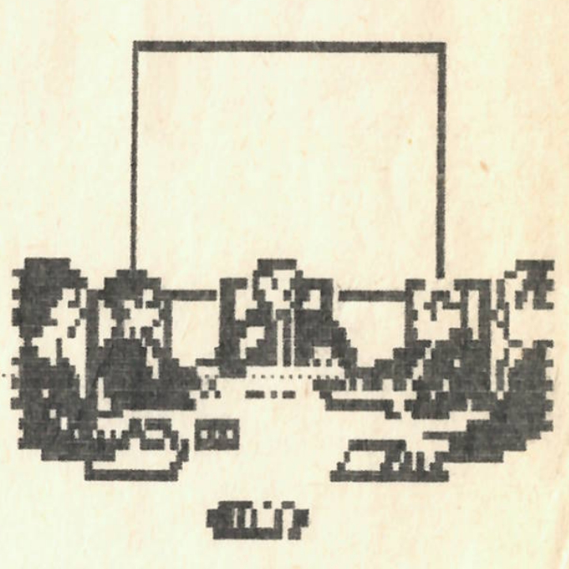

+++
title = 'A demokratikus átalakulások jegyében'
type = 'articles'
date = 1990-02-02
kicker = 'Megalakult az új szerkesztőség'
author = ''
description = ''
image = 'cover.png'
weight = 10
+++

{.align-right}

Örömteli szívvel tudatjuk minden kedves olvasónkkal, hogy pénteken, a kora délutáni órákban, a nyíltság és demokrácia jegyében megalakult újságunk új szerkesztősége, felváltva kiskirályi hatalmat gyakorló elődjét. Megújult lapunk új rovatokkal szeretne kedveskedni lelkes olvasótáborának. Fontos szerep jut ezután a **számítástechniká**nak, mellyel Szemethy Tivadar fog foglalkozni. Lesz benne számítástechnikai rejtvény, melynek legügyesebb megoldója jutalomban részesül, és számos meglepetés. Újdonság még az *irodalmi rovat*, melynek vezetői Galajda Péter, Golden Dániel és Pordán Ferenc. A legfrissebb **sport**híreket ezután Molnár Péter és Wágner Endre cikkeiből tudhatjuk meg. A *helyesírás* érdekességeit két híres szakember: Vágó András és Wágner Endre mutatja be. A szaftos **pletyká**kat három igazi szaktekintély: Péter Viktória, Molnár Mariann és Grigor Zsuzsa tálalja elénk. Izgalmas *fizika*feladatokat ezentúl nemcsak testvérlapunkban, a KöMaL-ban olvashatunk; Kárpáti Csaba különleges csemegékkel szolgál olvasóinknak. A Galajda Péter és Szekendy Alajos speciális kenyai *horoszkóp*jaiból megtudhatjuk a jövőnket. A *video*világ újdonságairól Virág Csaba és Kolics Bertold számol be. Örömmel vesszük olvasóink észrevételeit; ezekből állítjuk össze **Az olvasó írja** című rovatunkat.
