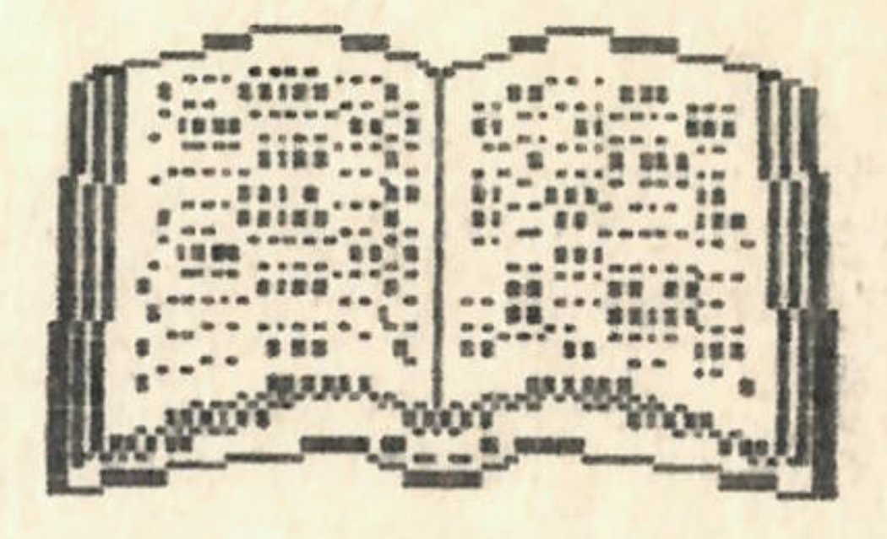

+++
title = 'Irodalom'
type = 'articles'
date = 1990-02-02
kicker = 'Berzsenyi Dániel elemzések'
author = '<pordán f. gábor>'
description = ''
image = 'cover.png'
weight = 30
+++

{.align-right}



## Berzsenyi Dániel: Fohászkodás

Berzsenyi ezen verse egyértelműen kirí többi művei sorából. Ez az egyetlen alkotása, mely vallási, az isten-ember kapcsolatot tárgyaló témájú. Ez az oka annak is, hogy Kazinczy e művet is azok közé sorolta, melyekről ezt mondta: "Én jónak tartanám e tíz darabot elégetni". A vers szerkezetileg és tartalmilag is két nagy egységre bontható: az első 4 versszak az első, az utolsó 3 versszak a 2. szakasz. Ennek oka az is, hogy a 2. szakasz valószínűleg jóval később keletkezett, mint az első. Az első szakasz istenszemlélete megegyezik a rousseau-i, voltaire-i felvilágosult istenképpel. Az Úr humanizálódik, emberléptékűvé válik (pl.: szemöldöke van). Szintén felvilágosult vonás az, hogy a versbe nem lép be az "én" képe (miáltal a mű objektív marad). Ez az első egység himnikus szerkezetű: megszólítással kezd, majd a himnusz szabályos folytatását alkalmazza. Megfigyelhető ebben a részben a "nagy tárgyak" iránti vonzalom, de ugyanakkor ezt a szenvedélyt jól ellensúlyozza az, hogy Berzsenyi hangsúlyt helyez rá: a kis dolgokat is ugyanaz a Teremtő alkotta, aki a hatalmas kolosszusokat. Összefoglalva: az első négy versszak a felvilágosodás, a klasszicizmus eszméit hordozza, bár istenközelségében inkább barokk.
A második ciklus jóval elégikusabb, "ima-szerűbb". Itt már megjelenik az "én", ezáltal a vers személyesebb jellegű lesz (mutatja ezt az is, hogy az összszövegben "Dicső" helyett "Atyám" szerepel). A hatodik versszakban a költő csak saját személyéről szól; magára marad a világban, az isteni segítség reménye nélkül. A későbbi korok bármely más írója, költője itt fejezte volna be a művet, azonban Berzsenyi ezt még nem merte vállalni, ezzel indokolható a hetedik versszak léte, mely tulajdonképpen új közlést nem tartalmaz, csak az ötödik mondanivalóját ismétli meg.
A vers nyelvi tagoltságának oka Berzsenyi megfogalmazásában a következő: "A dalokban a szívnek egyszerű nyelven beszéltem, az ódákban pedig a tárgy természete szerint harsogtam". Sokáig lehetne még beszélni a nyelvezet szépségéről, vagy a vers élményfolyamatáról; de mindent összevetve, azt hiszem, már ennyiből is kiderül a legfontosabb: az, hogy Berzsenyi e korszakában nem annyira klasszicista, sokkal inkább későbarokk-felvilágosult költő volt.

## Berzsenyi Dániel: Osztályrészem

Ami a vers olvasásakor legelőször szemünkbe tűnik, az a jelentés és a művészi konstrukció összetettsége, bonyolultsága. Nyilvánvaló, hogy minden versnek meghatározó része a fogalmi sík, a szorosan vett értelem; azonban nem lehet csak ennek alapján megérteni egy-egy költemény teljes jelentését. Mindig meg kell vizsgálni a költemény hangnemét, mely általában közöl velünk valami rejtettebb, mélyebb értelmet is. Különösen igaz ez a megállapítás Berzsenyi ezen versére, ahol a különböző jelentéssíkok sokszor kerül~b~nek ellentmondásba egymással. Fogalmi szinten a értelme: a költő életének megpróbáltatásokkal teli, de nem dicstelen szakasza lezárult, most már csak boldogság vár rá. A hely, ahol él, ugyan nem a bőség földje, de megad minden szükségeset. Nem rendítheti meg a végzet, feltéve, hogy vele marad Camoena, a költészet istennője. - A fogalmi-logikai ellentét nyilvánvaló: a költő végleges nyugalomról beszél - aztán kiderül, hogy a végzet szeszélye nem zárható ki a jövőből. Örök megelégedését állítja, de ennek felteteleket szab. Márpedig, ha a végzet nem zárható ki, akkor mi a biztosíték ezen feltételek teljesülésére? Az ellentmodásokkal teli fogalmi jelentés mellett feltűnően nagy szerepet kap a hangnem. A hangnem, mely az értelem ellentmondásosságával szemben töretlen kételynélküliséget sugall; ezáltal teremtve feszültséget. Ezzel függ össze leginkább a szándék: a negatív fogalmi jelentések visszaszorítása. Az első versszak két kijelentő mondattal indul: az első múlt, a második jelen idejű. A harmadik mondat egy távolabbi múltra utal vissza, míg a negyedikben elbeszélő múltat alkalmazza a költő. Így az első strófa lírai tömörítéssel sugallja a bekövetkező fordulatok eseményszerűségét. A második versszak visszatér az időbeni kiindulóponthoz, a partotéréshez; második sora három tagadása (semmi, soha, nem) azonban a már említett ellentétet sugallja, hiszen ha erre szükség van, az azt jelenti, hogy a szerző maga sem biztos nyugalma véglegességében.

Erre a versben még sok példát találhatunk, de ezek megkeresése legyen mindenkinek saját feladata. Még csak annyit, érdemes elgondolkodni azon, hogy a töretlen hangnem vajon a bizonytalan vágyakat erősíti-e meg, vagy épp ellenkezőleg: a tények bizonyosságát gyengíti-e.



