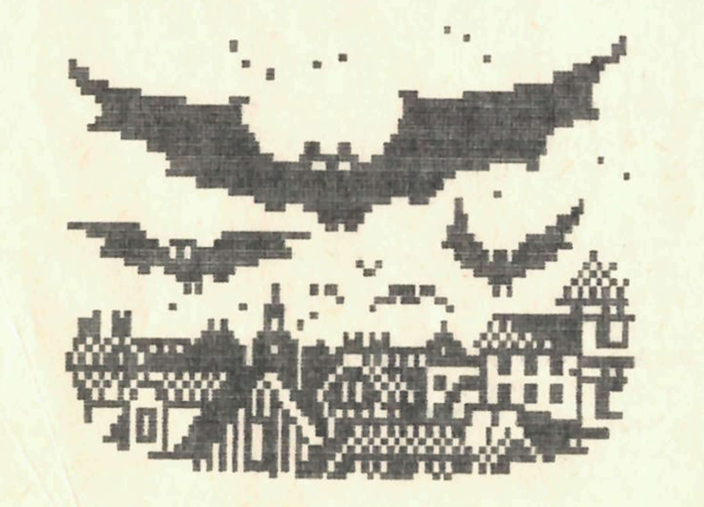

+++
title = 'Kenyai Horoszkóp'
type = 'articles'
date = 1990-02-02
kicker = 'Mi áll rólad a Nagy Könyvben?'
author = '<pati>'
description = ''
image = 'cover.png'
weight = 20
+++

{.align-right}



Kit nem izgat, hogy mi áll róla a Nagy Könyvben, ahol sorsunk meg van írva? Vajon érdemes-e holnap nagy összeget befektetnünk? Vállalkozzunk-e veszélyes hegyi túrára, kezdjünk-e szerelmi kapcsolatot az elkövetkezendő napokban? Meg egy kérdés felvetődhet bennünk: meg lehet-e tudnunk mindezt előre? Nyugodt szívvel állíthatom: meg. Erre a legjobb példát Kenyában találhatjuk. Itt évezredes hagyományai vannak a jövendőmondásnak. Jóslásaimkor én is kenyai módszereket használok, amelyek az esetek 93.643254178 %-ában bevalnak. Van miből válogatni: csontjóslás, homokjóslás, borzfültőmirigyjóslás, patkányjóslás, répalevéljóslás s meg ezerféle jóslási módszer kínálja magát. Egy profi kenyai mágus kb. 2000 féle eljárást ismer. Legelterjedtebb a csillagjóslás, az asztrológia. A kenyai asztrológia a hagyományos 12 helyett 10 jegyet különböztet meg.\
Ezek:

| | |
|---|---|
| a (kan)vipera | jan. 1- febr. 2 |
| a (nikkel) bolha | febr.3- febr.20 |
| a (.....)majom | febr.21 - márc.31 |
| a mormota | ápr.1- máj.20. |
| a hegyikecske | máj.21-júl.1 |
| a(z epi)borz | júl.2- aug.20 |
| a veréb | aug.21- szept.30 |
| az oposszum | okt.1- nov.30 |
| a kánya | nov.31- dec.6 |
| a béka | dec.7- dec.30 |

(Dec. 31-en Kenyában csak a királyok születtek. Ezzel a nappal egy külön tudóscsoport foglalkozik, a szilveszterióták.)

## EGY KIS JELLEMZÉS

**(Kan)Vipera:** a vipera jegyében születettek lassú, sikamlós egyéniségek. Ne háborgassuk őket, mert gondolkodás nélkül támadnak, s méregfogukkal komoly sebeket ejthetnek. Nem jó társalgók, szeretnek vackukba visszahúzódni. Óvakodjanak a Bolháktól !!!

**Bolha:** "...pattog, mint a nikkelbolha...".Ez a szólás pontosan illik rájuk. Nem találják helyüket, ide-oda pattognak, mindenkire ráakaszkodnak.Még a kánvipera sem árthat nekik. A Bolhák nyíltak, nem szégyenlik megmutatni magukat, bár ez nehézségekbe ütközik: jelentéktelen külsejükkel alig lehet észrevenni őket.Bárhogy ugrálnak is. Tehát kedves Bolhák, kár a fáradságért!!! (folytatjuk)



