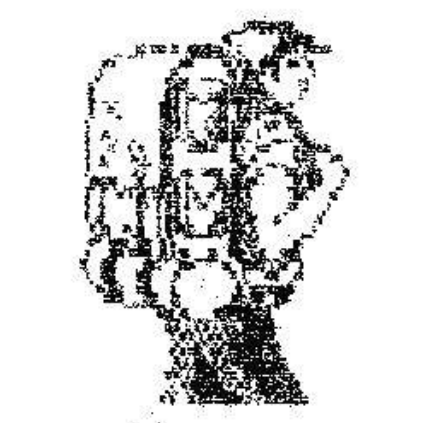

+++
title = 'Zöld erdőben jártunk...'
type = 'articles'
date = 1990-02-19
author = '<pati>'
description = ''
image = 'cover.png'
weight = 10
+++

{.align-left}



Osztályunk különleges vonzódása a természet, a túrázás iránt , valamint a tavalyi élmények késztettek minket arra , hogy február első hétvégéjén elzarándokoljunk az Augusztin tanyára , s néhány napot töltsünk ott. A kirándulást precíz előkészítő-munka előzte meg, e nélkül felelőtlenség lenne ekkora útnak vágni. Jónéhány nappal előre megszerveztük az élelmiszerellátást. Kiszámoltuk, miből mennyi kell; elterveztük, hogy ezeket hogyan szerezzük be.

Pénteken a 3. óra után elindultunk a piaci kenyérbolt megostromlására. Miután végeztünk a cipókészlet kiürítésével (melyet a sorban mögöttünk állók értetlenül figyeltek) a buszpályaudvar felé vágtattunk. Itt a kenyerek egyenletesen elosztva a hátizsákokba vándoroltak. Néhány perces várakozás után körünkben üdvözölhettük a busz indulása előtti utolsó pillanatban befutó Balázst, s így a kulcsokat is birtokunkban tudhattuk. Végre elindultunk.

A sűrű ködben rövid utazás után egy Hárskút mellett vezető út szántóföld felőli oldalalán találtuk magunkat. Lelkileg felkészültünk az előttünk álló táv megtételére, majd nekivágtunk. A helyi ebek támadásait állva átvergődtünk a falun, majd bokáig érő sárban elszántan törtünk előbbre, s egyre előbbre. Hipp hopp, már benn is voltunk az erdő közepében. Néhányan tudták, merre járunk, nekik köszönhetően nemsokára elértük úticélunkat. Izgatottan vettük szemle alá az otthonos kis szállást. De nem sokat teketóriáztunk, munkának láttunk. Balta csattogott, fűrész zenélt, fa reccsent, s a cserépkályha már ontotta is a finom meleget (túlságosan is). Lányaink az egerek által hátrahagyott nyomok eltüntetése után a tisztává varázsolt konyhában elfoglalták állásaikat a tűzhely és a mosogatótálak előtt.

Páran elindultunk egy közeli barlang felkutatására. Azonban ez a kísérletünk kudarcba fulladt, mivel egy hatalmas sziklás oldal megmászása után a barlangnak nyomát se leltük. Még egy nyavalyás egérlyukat sem találtunk.Ez azonban nem vette el kedvünket. Jó hangulatban tértünk vissza szállásunkra. Egy kis lazítás után az asztal mellé ültünk, s nekiláttunk a paprikáskrumplinak. Az volt ám a lakoma! Még kolbász is jutott bele. Rövid emésztés után folytatódott a tüzelőanyag utánpótlása. A fűrésszel ugyan meggyűlt a bajunk, mert nemcsak a fát, hanem a mutatóujjunkat sem kímélte. Azonban Kárpi a csajok közreműködésével szakszerűen ellátta a sebeket s kötéssel a kezén sem állott a munka. Számos barátommal (Szeky, Laca, Fecó, Albertcsabi) a közeli kulcsosház előtti mezőn három szénaboglyát fedeztünk fel. Nosza, nekünk sem kellett több! Bele a közepibe, hadd szóljon!! Artistaszámaink bemutatása után visszatértünk a báisra (Augusztin tanya) a az éjszaka további rész tisztálkodással beszélgetéssel, tévézéssel, alvással, miegymással telt. Augusztin szelleme úgy látszik elkerülte társaságunkat. (folytatjuk)


