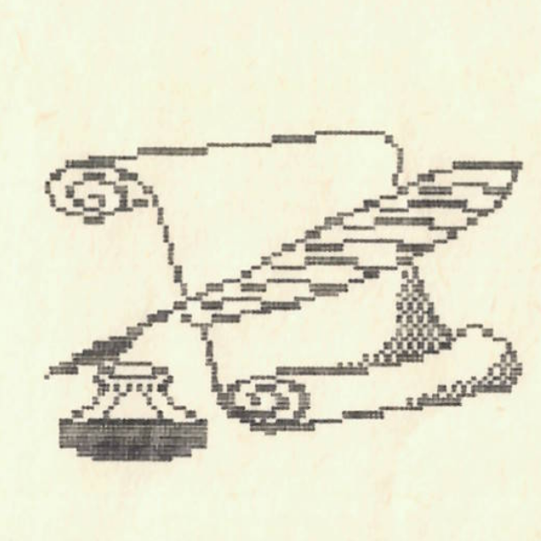

+++
title = 'Hej̲esírás'
type = 'articles'
date = 1990-02-19
kicker = ''
author = 'Bedeco'
description = ''
image = 'cover.png'
weight = 50
+++

{.align-right}



Sokan felteszik a kérdést magukban, hogyan lehet megtanulni helyesen írni. Erre a kérdésre ad most a választ a nyelvtudományok doktora a Magyar Tudományos Akadémia tagja Dr. Bubó. -Első és egyben legfontosabb jótanácsom, hogy olvassuk el az összes kötelező és ajánlott olvasmányt; ezekből ugyanis sok okosat lehet tanulni, a helyesírással kapcsolatosan is. Második tanácsom a haladóknak szól. Ti ne csináljatok semmit azonkívül, hogy segítitek helyesírásban gyengébb társatokat azért, hogy ők is jó eredményeket érjenek el, ha nyelvtanból dolgozatot ír az osztály. Harmadik tanácsom azoknak szól akiknek alapfokú ismereteik vannak a helyesírásról. Nos kedveskéim ne csináljatok mást mint, hogy sűrűn lapozzátok a Helyesírásunk című könyvet. Akik nemtudnak helyesen írni azok írjanak minden nap tíz spiráloldalnyi szöveget és magoljátok be az összes szabályt a Helyesírásunk című könyvből. Ha netán ez nem segítene, akkor vigyétek magatokkal mindenhová a "könyvet", és használjátok is. Most egy-két szót az értékrendszerről. Haladó helyesíró az, aki ötös vagy négyes helyesíró. Alapfokú tudással rendelkezik mindenki, aki hármas nyelvtanból. A maradékról jobb nem is beszélni.



