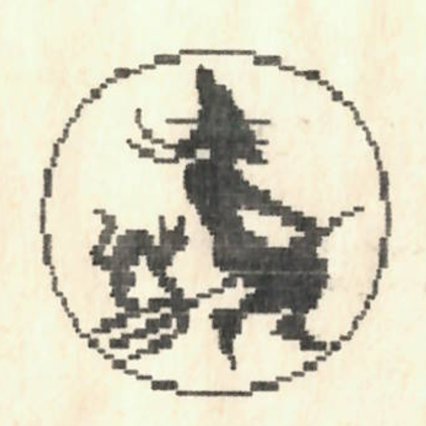

+++
title = 'Kenyai Horoszkóp'
type = 'articles'
date = 1990-02-19
kicker = 'Mi áll rólad a Nagy Könyvben?'
author = '<Szeky>'
description = ''
image = 'cover.png'
weight = 30
+++

{.align-right}



Előző számunkban nagy vonalakban már megismerhették a kenyai horoszkópot. Mint már tudják, a kenyai asztrológia 10 különböző jegyet különböztet meg. Ezeket már ismertettük. Hasonlóan a kínai asztrológiához, a jegy névadó állatának jelleméből következtethetünk a személy jellemére. Most folytatjuk a jegyek rövid ismertetését:

(...)majom (febr. 21 - márc. 31.): A majom hava a tavasz és a tél határára esik. Emiatt az ekkor születettek személyisége is óriási különbségeket mutathat. Ezek azonban a jegyen belül tovább csoportosíthatók, aszerint, hogy a jegy melyik hetében születtek:

1. hét: Csimpánzok. Talán ők a legértelmesebbek (a majmok közül). Jó a kézügyességük, szeretnek festeni, énekelni, játszani, de nem igazán művészi fokon. Sok gyakorlással és türelemmel megtaníthatjuk őket, hogy a fürdőszobában a kék a hideg, a piros pedig a meleg víz. A természetben érzik jól magukat, de igazi társasági emberek. Mindig nyíltan kimondják, amit gondolnak, s akár akarják, akár nem, mindig rájuk figyel mindenki.

2. het: Gibbonok. Az ekkor születettek rendkívül jók az ügyességi sportokban, és csak a legritkább esetben buknak testnevelésből. Ekkor a tanár minden bizonnyal gorilla (ld. később), akik köztudottan utálják a gibbonokat. A gibbonok tornaszképességükön kívül néhány más dologhoz is nagyon jól értenek. Például 12700 méternél magasabban fekvő vízvezetékek karbantartásához kizárólag csak őket alkalmazzák.

3. het: Gorillák. Ők elsősorban hatalmas testi erejükkel tűnnek ki, de ennek ellenére nem buták (tisztelet a kivételnek). Közülük kerülnek ki a legjobb tornatanárok, karateedzők, személyi testőrök, súlyemelők. Ha felingerlik őket, egyetlen jólirányzott ütéssel vitapartnerükbe fojtják a szót. Ha a közelünkben gorilla él, jó lesz, ha felszereltetünk még egy zárat, és este 11 óra után nem megyünk ki az utcára.

4.hét: Orangutánok. Testük technikai paraméterei megegyeznek a gorillákéval, de azokkal szemben csendes, nyugodt, megbízható egyéniségek. Keveset beszélnek, nincsenek igényeik. Egy orangután mindig segít nekünk, ha bajban vagyunk. Ha veszély fenyegeti őt vagy valamelyik embertársát, nem ismer sem félelmet, sem kegyelmet. Egy gorilla szomszéd ellen legjobb orvosság (az elköltözésen kívül), egy orangután szomszéd beszerzése a gorilla mellé.

5.het: Félmajmok. Mint nevük is mutatja, nem igazi majmok, ezért a legkülönfélébb tulajdonságokkal rendelkeznek. Nagyon jól látnak a sötétben is, s hallásuk is jó. s szaglásuk és ízlelésük sem mindennapi. E tulajdonságaiknak köszönhetően a KERMI szakembergárdájának gerincét ők alkotják.

Figyelem! Február 29. nem tartozik egyik héthez sem, külön csoportot alkot, amellyel majd külön foglalkozunk. Észrevehették, hogy a majmok jellemzése hosszabbra sikeredett a múltkoriaknál. Ennek speciális földrajzi okai vannak: Kenyában az epiborzok után a majmok a legelterjedtebbek. Legközelebb a mormotákról olvashatnak majd.



