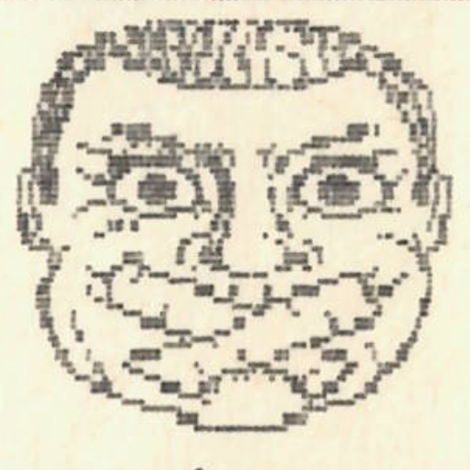
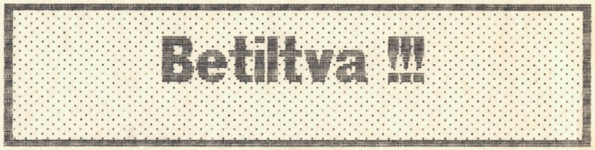
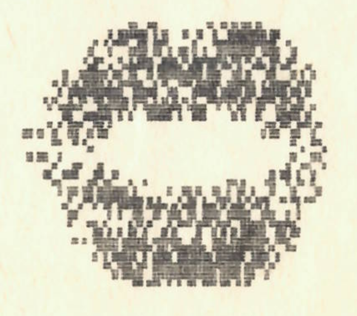

+++
title = 'Pletyka'
type = 'articles'
date = 1990-02-19
kicker = ''
author = ''
description = ''
image = 'cover.png'
weight = 40
+++

{.align-right}



Az a hír kapott szárnyra az országban, hogy valami vandál banda barbár módon szettúrt három szalmakazlat. A hírek nem közölték a tett színhelyét, de furfangos módon kiderítettük, hogy a Hárskút melletti Augusztin-tanyán történt a brutális pusztítás. A vendégkönyvbe írt bejegyzések alapján feltehetőleg gimnazisták voltak (valószínűleg valami kisegítőből). A már említett helyszínen ekkor más is történt: Bizonyos S. Zoltán, a gyermekek osztályfőnöke majdnem levágta bal keze mutatóujját, mivel egy V.K. Andrea nevű tündérke favágás közben elterelte a figyelmét. Vallomásából kiderült, hogy Andrea eredetileg arra számított, hogy a tanár úr a jobb kezét vágja el, és így nem tud majd a táblára írni.

\* \* \*

**A közmondás úgy tartja, hogy a nők, ha szerelmi bánatuk van, vagy állandóan esznek, vagy fogászatra mennek. Egy jó példa: A Timó állandóan kajál, a Karola meg fogászatra jár.**

\* \* \*

Vagó Bandi a nők bálványa

Bizonyára mindenkinek roppantmód hiányzik társaságunk jeles férfi tagja: Vagó Bandi. Betegségre gyanakodva városunk kitűnő kórházába látogattunk el, ahol felvilágosítottak minket a következőkről: idegrohamot kapott, összetörte a borotváját, mindezt azért, mert nem kapta meg szokásos alkoholadagját. Most elvonókúrán van, Devecseren. Azonban ott sem bírnak vele, mert Somba nem vitte be neki a zugpiáját.

\* \* \*

\* \* \*

Szeky állítólag a legjobban megfizetett modell a Playgirl-nél. Kémeink azt csiripelték, hogy egy-egy fotóért 2x10^^6^^ $ fizetséget kap.



