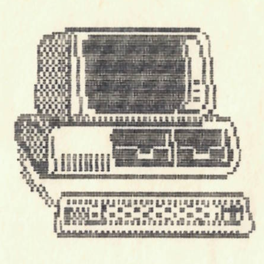

+++
title = 'Számítástechnika'
type = 'articles'
date = 1990-02-19
kicker = ''
author = '<Szt>'
description = ''
image = 'cover.png'
weight = 60
+++

{.align-right}



**Rövid összehasonlító kritikai elmélkedés az amiga és a ZX81 különbségeiről és hátrányairól (az amigának)**

Kezdjük a két gép összehasonlítását grafikai lehetőségeik bemutatásával:

1\. Grafika - az amigának állítólag 4096 színe van, amit mellesleg egy olyan osztálytársunk állít, aki minden kiválósága ellenére színtévesztő, tehát sajnos e kérdés megítélésében véleményét nem vehetjük figyelembe. Tapasztalat alapján bízvást állíthatjuk, hogy a legtöbb helyen számítógépezésre fekete-fehér TV-t használnak, tehát az amiga programozásának azon előnye, hogy több színt kezel, nyilvánvalóan eltörpül a ZX81 grafikájának frappáns egyszerűsége mellett, tehát a grafikai képességek összehasonlításában kétségbevonhatatlanul a ZX81 nyert.

2\. Hang - Eme pontban a ZX81 előnye annyira nyilvánvaló, hogy sok indoklást nem is igényel, csupán néhány példát hadd közöljek: az elmúlt években a "Bit-Let" c. kitűnő szaklapban több, ZX81-re írott hangdigitalizáló, zongorázó, stb. program jelent meg, míg az amigára egy sem. Egy zenei műsoros kazettát is készítettek a ZX81, a Spectrum és az IBM PC segítségével, ami megvásárolható a hanglemezboltokban. (természetesen csak amiga készlet tart) Címe: P.R. Computer

3\. Sebesség - Erre is csak néhány rövid példa: a ZX81 egyaránt használható SLOW és FAST üzemmódban is, míg az amigán ilyen nem létezik, az csak a SLOW üzemmódot ismeri. Köztudott az is, hogy az amiga az ún. 3.5-ös floppy-ját igen lassan kezeli - természetesen ellentétben a ZX81-gyel.

4\. Vírusveszély - Ennél a rendkívül fontos pontnál ismét találkozhatunk a **Sinclair Research Ltd.** kiváló szakembereinek egy újabb programozói telitalálatával. A ZX81 ROM programjában elhelyeztek egy zseniális vírustalanító rutint (állítólag ez még a Hornák-félénél is jobb, de ezt H. Z. tagadja), ennek következtében ezeddig egyetlen ZX81 felhasználó sem találkozott még vírussal. Ezzel szemben a legutóbbi CHIP magazin tanúbizonysága szerint eddig 10 amiga-vírust határoztak meg.

folyt.köv




**Lapunk következő számában már lesz számítástechnikai rejtvény is!!!**


