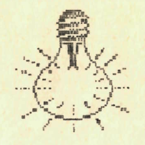

+++
title = 'Fizika'
kicker = 'Kérdések, feladatok'
type = 'articles'
date = 1990-02-27
author = 'Rovatvezető: Kárpáti Csaba'
description = ''
image = 'cover.png'
weight = 60
+++

{.align-right}



Kérdések, feladatok:

1\. Miért van a fényképezőállványnak 3 lába? (miért nem 2 vagy 4 lába van ?)

2\. Egy gőzös oldalán acélhágcsót engednek le. Ennek alsó négy foka vízbe ér. Mindegyik fok vastagsága 5 cm, a fokok közti táv 30 cm. Megkezdődik a dagály, és a víz óránként 40 cm-t emelkedik. A hágcsó hány foka kerül a víz alá 2 óra múlva? 5 óra alatt?

3\. Erősítsük meg kerékpárunkat úgy, hogy ne dőljön el. A pedálok függőleges irányban helyezkedjenek el, az egyik a lehető legalacsonyabb, a másik a lehető legmagasabb helyzetben legyen. Köss az alsó pedálhoz zsineget. A kerékpár mögé térdelve meghúzzuk vízszintes irányú erővel a zsineget. Milyen irányban indul el a kerékpár?

4\. Egy vízzel félig megtöltött üveg dugóval el van zárva. A dugón keresztül egy olyan üvegcső vezet az üvegbe (beleér a vízbe), amelynek másik vége egy pohárba visz. Hogyan lehet a poharat megtölteni vízzel a dugó kivétele és az üveg megdöntése nélkül?

5\. 20 m hosszú, 3 m magas kőfal tömege 3 tonna. Hogyan lehet puszta kézzel ledönteni, ha segédeszköz nem használható?

Megoldásokat a következő szám megjelenéséig fogadunk el. (Figyelem! A feladatok megoldása <u>a Mikola-versenyen indulóknak kötelező</u>!!!!)


