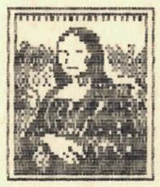
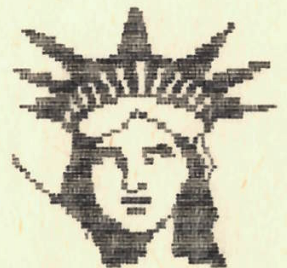
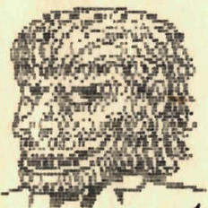

+++
title = 'Kenyai Horoszkóp'
type = 'articles'
date = 1990-02-27
author = '<pati>'
description = ''
image = 'cover.png'
weight = 30
+++

{.align-right}



Folytatjuk a jegyek ismertetését.

MORMOTA: Legszembetűnőbb sajátosságuk a lustaság, álmosság. Legszívesebben átaludnák egész életüket, csak enni kelnének fel. Aki alvás közben zavarja őket, az halál fia! Igen önfejűek, földhözragadtak. Nem szeretik a változatosságot. Sok Mormota akad a politikusok között (főleg az elmúlt 40 évet tekintve). Az ellenzéki Bolhák őket nyaggatják a legszívesebben. A Bolhák egyébként is nagy veszélyt jelentenek rájuk. A lusta Mormotákat már a kis pattogók virtuozitása is kikészíti, hát meg ha piszkálják, csipkedik is őket. Ha nem vigyáznak, könnyen válhatnak a Viperák zsákmányává s a Majmok játékszerévé. A többiekkel általában jól megvannak, ha békén hagyják őket.

{.align-right}

HEGYIKECSKE: Oh, azok a kecses vonalak, formás idomok, könnyed szökellések! Itt aztán akárki megtalálhatja nő-/férfi-ideálját (külsőre)! Találunk köztük manökeneket, fotómodelleket, Playboy-sztárokat, színészeket, énekeseket. Elkápráztatnak bennünket szépségükkel ....., amíg meg nem szólalnak. Mert akkor aztán összemekegnek mindenféle butaságot. Szellemi képességeiket tükrözi, hogy a legkönnyebben ők szarvazhatók fel (kecske), csalhatók meg. Csak magukkal törődnek. Akkor játszhatjuk ki őket, amikor akarjuk! A Bolhák őket sem kímélik, de vigyázzanak a Viperákkal is! Undorodnak a Békáktól, tehát a Béka-Hegyikecske kapcsolat szinte kizárt. A férfi Kecskére a szolid szakáll, határozott arcél, a nő Kecskére lágy esésű haj és aa... hogy is mondjam... telt idomok, kerek formák a jellemzők, a sportosság határain belül. A kecskének 4 lába van, mégis megbotlik, még ha hegyi is! Legyenek óvatosak!

{.align-right}

EPIBORZ: Tökély az 5. hatványon!! Ami jó csak van, az bennük megtalálható. Szépség, okosság, erő, akarat, kitartás, jószívűség, segítőkészség, udvariasság s meg ezernyi jótulajdonság. Ezzel tulajdonképpen mindent elmondtunk róluk.

{.align-left}
(Azért vannak kivételek a csillagok bizonyos állásánál. Például 1974. augusztus 5 és augusztus 9 között a Mars és a Szaturnusz szubexterdáns eszenciájának negatív rezonanciája igen nagy torzulásokat idézett elő a jellemben és a külsőben egyaránt.) U.i.: Ebben a jegyben a július 13-i születés igen ritka. Erre nincs egyértelmű jellemzés. (folytatjuk)


