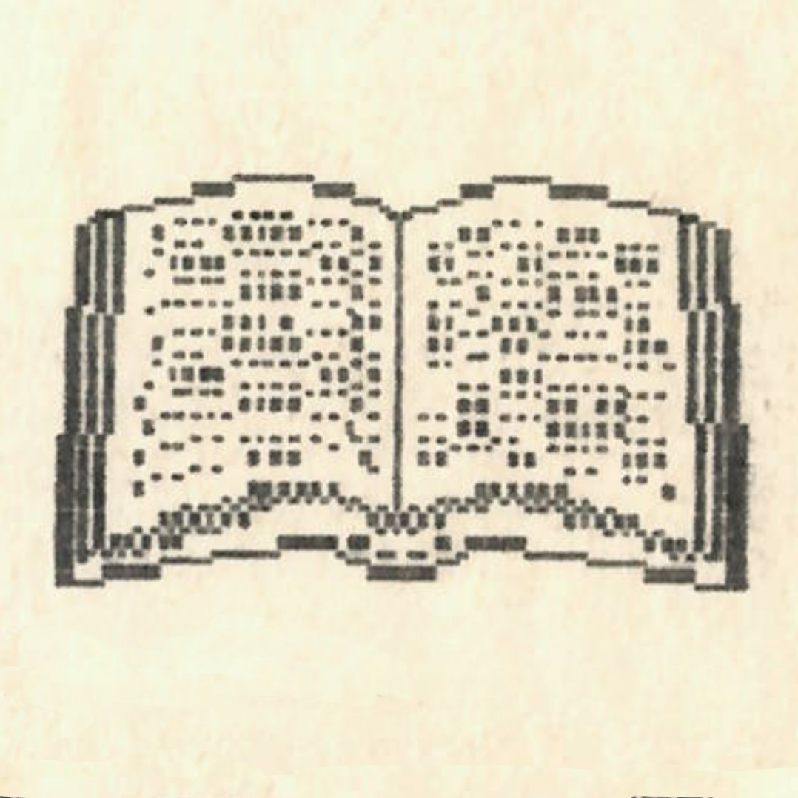

+++
title = 'LI TAJ-PO (701-762) versei'
kicker = 'Irodalom'
type = 'articles'
date = 1990-02-27
author = 'Li Taj-Po'
description = ''
image = 'cover.png'
weight = 50
+++

{.align-right}



> FELESÉGEMNEK

Míg tart az év, harmadfélszáz napon\
oly részeg vagyok, mint az út sara.\
Li Po neje vagy s különb sorsú-e,\
mint a részeg hopmester asszonya?

> ÉNEK A SZOMSZÉDASSZONY\
> KELETI ABLAKÁNÁL LEVŐ\
> GRÁNÁTALMAFÁRÓL

Lu asszony keleti ablaka alatt\
a gránátalmafa ritka ékesség.\
Zöld vízben ragyogó korall pompája\
oly fényes talán, mit hozzá mérhetnék.\
Szelekben lebeg szét tiszta illata,\
madarat ringat, ha jönnek az esték.\
Délkeleti ága hogyha lehetnék,\
végigsimítanám Lu asszony testét.\
S ha egyszer letörne, s házába vinna,\
aranyos ajtaja mögé nézhetnék.


