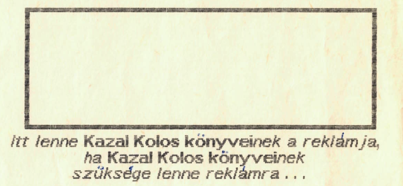

+++
title = 'Számítástechnikai feladat mesés díjazással'
type = 'articles'
kicker = 'Számítástechnika'
date = 1990-02-27
author = '<Szt>'
description = ''
image = 'cover.png'
weight = 40
+++

{.align-right}



Ezen feladat minden eltérő elvű megoldását 1 db közös megegyezés alapján eldöntendő típusú csokoládéval díjazzuk, melyet ünnepélyes keretek között a Daily News c. lap felelős szerkesztői fognak átnyujtani 1 db emléklap és 2 db vállveregetés kíséretében.

A feladat a következő:

Írjunk programot, amely kiírja egy n elemű halmaz összes k elemű részhalmazát (k és n természetes számok, a halmaz elemei (legyenek ezek egész számok), n, k, és a halmaz bemenő adatok).

Közli: <Szt>

A feladat megoldását az illetékes rovatvezetőnek (Sz. T.) kell bemutatni.



