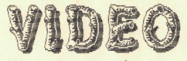
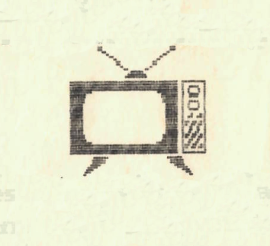

+++
title = 'Videó'
type = 'articles'
date = 1990-02-27
author = 'Toncsi'
description = ''
image = 'cover.png'
weight = 70
+++

{.align-right}



Halló Videósok!! Halló Déli Nyúzz olvasók!! Itt a Videó-rovat első (és reméljük nem az utolsó) száma!! Persze örömünk (mármint a szerkesztők öröme) nem olyan határtalan. Az osztályban kifüggesztett bejelentkezésünkre és ezen belül kérésünkre senki nem reagált érdemlegesen. Csak egy hétpróbás boszorkány (nevezetesen M. Mariann) mutatott kisebbfajta érdeklődést a rovat iránt. Na, de sebaj! Mint tudjátok (vagy talán nem?) Barbi szereti az "Amit a ...-ról feltétlenül tudni kell" sorozatot (lásd például Anti-Vágó demo 2), ezért úgy határoztunk, hogy elindítjuk az "Amit a Buguo-ról feltétlenül tudni kell" című cikksorozatot. Az első részben a Buguo (e.: vigyió) belső felépítésével foglalkozunk. A következő részekben majd képeket(?) is mutatunk arról, hogy milyen is a Buguo.

## Amit a Buguo-ról feltétlenül tudni kell . . .

A Buguo belső felépítése elég szilárd, de nem fedezhetünk fel benne jól elkülöníthető csontszövetből álló gerincvázat, ezért inkább külső páncélja alapján lehet besorolni a kagylók/teknősök osztályába. Gyorsan fejlődő faj, közeli rokona a szi dí plélyer. (A következő részben őróla is leközlünk képet(?), és bemutatjuk a különbségeket e két igen lényeges faj között). Buguo-nk még az egyedfejlődés korai tagja, így gondolkodása és beszédtechnikája még nem egészen fejlett. /Ezért nincs logopédus, matematikus stb. Buguo. Még!!/ De azért kommunikálhatunk vele a kommunikációs ábrának megfelelően. Például megkérdezhetjük tőle, hogy akar-e velünk színházba, moziba, boltba, operába, könyvtárba, sétálni, stb. jönni. Ilyenkor elkezd gondolkodni, és mire eldönti, hogy velünk jön-e, már régen megöregedtünk. Akkor pedig már inkább filmmúzeumba, öregek otthonába akarnánk vinni, de oda nem szeretne velünk jönni, és mivel nem akar megbántani minket, ezt nem mondja meg. Ebből is láthatjuk milyen érzékeny is a Buguo. E lap szűkös terjedelme miatt most csak ennyit tudunk közölni a Buguo-ról.


