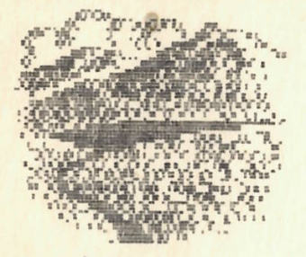
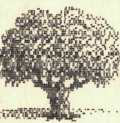
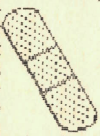
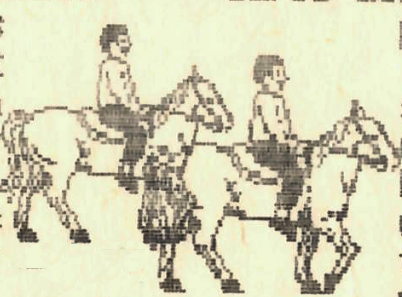
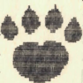
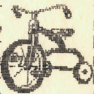
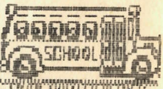
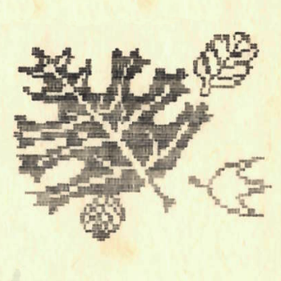

+++
title = 'Zöld erdőben jártunk ...'
type = 'articles'
date = 1990-02-27
author = '<pati>'
description = ''
image = 'cover.png'
weight = 10
+++

{.align-left}



Másnap reggel kakasszó híján a felkelő nap első sugaraira ébredtünk. A szokásos reggeli teendők elvégzése után a konyha tündérei finom reggelivel örvendeztettek meg bennünket. Rövid készülődés, majd nekivágtunk a Bakonybél felé vezető útnak. Útközben megcsodálhattuk a természet kincseit: a szép fákat, különös sziklaformákat. Az erdő napfényben fürdött, s fülünk az ágak halk reccsenését, a madarak csicsergését élvezhette.
Csodálatos út volt (odafelé). A faluban feltöltöttük élelmiszerkészleteinket, s a tanár úr kezeit hozzáértő apácakezek ápolgatták. Megtekintettük a kápolnát, s a Jézus szenvedését ábrázoló képek által szegélyezett úton egy aranyos kis tisztásra jutottunk.

{.align-left}
Rövid időzés után vidáman, beszélgetve nekivágtunk a vissza- útnak. Akkor még nem tudtuk, mi vár ránk. Néhány órás erdei gyaloglás után nyögve megmásztunk egy sáros domboldalt, majd néhány perces pihenő következett az út mellett.

{.align-right}
Itt feléltük a teába szánt citrom és citromlé egy részét. Folytattuk az utat. Még egy lótenyésztő istálló is utunkba esett (furcsa látvány lehettünk, az ottani_ak_ igen ferde szemmel néztek ránk, s az egyik fiú csak seprűvel felfegyverkezve merészkedett az ajtóig).
Egy kicsit élveztük a kecske bégetését (hogy ez hogy történhetett?!), majd továbbmentünk. Hosszú gyaloglás után ismerős tájat véltünk felfedezni, s néhány perc múlva, otthon voltunk. Nem sok idő maradt a pihenésre, mert a ház körül még sok volt a munka.

{.align-left}
Az est hátralevő része kellemes favágással és mosogatással telt. A többieknek is tudtára adtuk felfedezésünket, így a szénaboglyákat az osztály jelentős része kipróbálta. Vasárnap reggel az étkezés után rövid beszélgetés zajlott, melyet - az előző esti részletekkel együtt -, a magnó is megörökített. Ettünk, ittunk, takarítottunk, a tanya fénybe borult. Példás rendet hagyva magunk után, hazaindultunk.
A Kárpi nehezen tudott elszaladni az emlékek elől, s így néhány száz méter megtétele után hirtelen visszafordult, és Balázs kíséretében a villanyóra kikapcsolásával egybekötött, rövid látogatást tettek a tanyán. Visszaérkeztük után a gyalogtúra folytatódott.

{.align-left}
Élveztük az erdőt, kíváncsian vizsgáltuk a szarvasnyomokat. Utunkat kisebb pihenők szakították meg, s ilyenkor sasként csaptunk le a megmaradt kenyerekre.

{.align-right}
Lassan előtűnt Herend látképe. A város nevezetességeiből először három szántóföldi motorost vehettünk szemügyre, majd a település belsejébe is bemerészkedtünk, pontosan a buszmegállóig.
Itt a megértő vezető bevárta csapatunk hátrább kullogó tagjait, majd Veszprémbe fuvarozott minket. Innen élményekkel megrakodva tért ki-ki otthonába.
 

{.align-left}

{.align-right}
Ez a kirándulás kellemes, maradandó élmény volt az osztály számára, s így biztosan jövőre (sőt azután) sem hagyjuk ki. Várj reánk Augusztin!

/ U.i.: A kútban élő gőték és a szellem legendájából egy szó sem igaz!/



