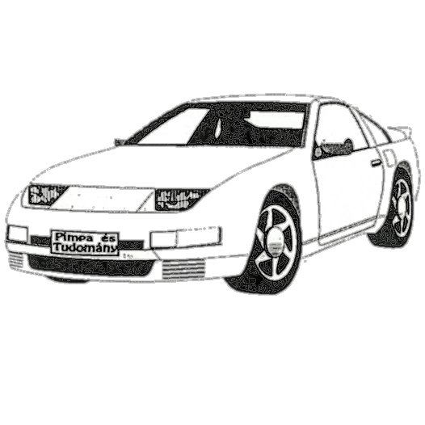

+++
title = 'Brassai aprópecsenye'
kicker = 'Gazdaság'
type = 'articles'
date = 1992-05-05
author = '<Totó>'
description = ''
weight = 30
+++

Új rovattal jelentkezik az újból megjelenő Pimpa és Tudomány. E rovatunkkal a jövő üzletembereinek, befektetőinek kívánunk segítséget nyújtani. Apró, rövid hírekben próbáljuk meg összefoglalni az elmúlt időszak legfontosabb, legérdekesebb gazdasági eseményeit. Rovatunk jellegére utal a címe is. (Ki ne hallott volna a híres HVG-ajánlásokról?) Ezúton is szeretnénk jelezni, hogy szívesen fogadunk minden olvasói észrevételt, ötletet.

Mint tudjuk, egy sikeres üzletemberhez egy elegáns, modern kocsi is hozzátartozik. Nemcsak üzletembereknek, de mindenkinek nyugodt szívvel ajánlhatom az Opel Astrát, melynek első Magyarországon gyártott példánya március 13-án gördült le a szentgotthárdi szerelősorról. A gyártók úgy tervezik, hogy ára a hasonló kategóriájú kocsik alatt marad: kb. 950.000, azaz kilencszázötvenezer forint alatt marad. Bárki számára könnyen elérhető, (?!?? <szerk.>) úgy gondolom. Rossz hír viszont, hogy a "belevaló" a parlament döntése alapján május 1-től 5 Ft-tal drágul. Újabb emeléstől a közeljövőben nem kell tartanunk, mivel a MOL Rt. kijelentette, a forint leértékelése ellenére nem emeli a motorbenzin árát. E jó hírrel búcsúzunk, viszlát legközelebb:

< Totó >

Lesz legközelebb? Én nem tudtam róla.

<szerk.>


# Nyílt nap

– Ez az a hely amiről beszéltem. És most engedjék meg, hogy bemutassam ...

– Mit tudhat egy irodalomtanár az informatikáról...

– ... engedjék meg, hogy bemutassam önöknek az LLG pusztító hatását! Egyformának látszanak, de nézzük meg közelebbről: Egy jó fizikaóra halványan megmarad a dolgozatírás után, míg ugyanennek irodalom esetében nyoma sem látszik.

– Ez igen!

– Na ne mondja, hogy csak az irodalomórán van ilyen!

– Mi ez?

– Nézzek, hogyan pusztítják az LLG aktív részecskéi a szabadidőt!

– Egész meggyőző...

– De mi van azokkal a diákokkal, akik nem jutnak el a negyedikig?

– Az LLG tökéletesen pusztít. Már alsó évfolyamokon is.

– Engem meggyőzött. Ez egy jó iskola. Biztos, hogy én kipróbálom?



|FELHÍVÁS!|
|:--:|
| |
|Ismeretlen személyek visszaélnek a Bácska Rt. Vaskút nevével és plakátokat helyeznek el az ország különböző részein, melyek szerint irreális árakon hirdetik nevünkben a húsnyúl felvásárlását. Cégünk elhatárolja magát a plakátok kihelyezésétől és az azokon szereplő árak hirdetésétől. Egyben|
|**10 000 FORINT**|
|**JUTALMAT TŰZÜNK KI**|
|annak a nyomra vezető személynek, aki perdöntő módon bizonyítani tudja, hogy ki rontja a Bácska Rt. Vaskút hitelét!|

&nbsp;

**Bácska Rt. 6521 Vaskút, Kossuth u. 105.**\
**Tel.: 79/23-011**\
**Telex: 81-281.**

750/MH
(X)


---

A P&T szerkesztősége mélyen elítéli az ehhez hasonló cselekedeteket, és segíteni kíván a tettesek kézre kerítésében, ezért a fenti - a NAPLÓban megjelent - hirdetést térítésmentesen teszi közzé.

Ezen az oldalon lett volna tudósításunk a lengyel-piac kínálatáról, de tudósítónk (V.A. úr) beleveszett a gazdasági élet útvesztőjébe.
