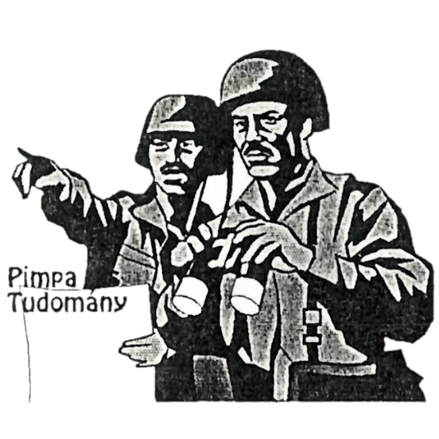
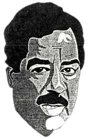
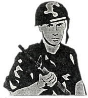

+++
title = 'Irak ...'
type = 'articles'
kicker = 'Külpolitika'
date = 1992-05-05
author = '<Lojzicica>'
description = ''
weight = 20
+++

### Mítosz és valóság



*Az alábbi interjú a Pimpa és Tudomány 1990 október 24-ei 2. számában jelent volna meg. A cikk azonban mit sem vesztett aktualitásából.*

< szerk. >

Mint kiküldött tudósító, a P&T főszerkesztőjétől megbízást kaptam egy iraki helyszíni tudósítás elkészítésére. Rögtön a dolgok közepébe vágtam, elindultam a mesés Kelet felkutatására. Sajnos a szerkesztőség anyagilag nem finanszírozta az utazást, ezért csak Csopakig jutottam el, de nem is kellett tovább mennem, mert kitűnő irak-szakértőre leltem. Az illető ragaszkodott inkognitójához, kívánsága szerint ezért egyszerűen Jenőnek hívtam. Ha esetleg valaki megbotránkozna a leírtakon, ne a szerkesztőséget ostromolja felháborodott leveleivel, ez egy interjú, nem is találtam ki. No, de vágjunk mindjárt a közepébe:

– Kedves Jenő! Ön közismert irak-szakértő, a TBC (Táncoló Boci-Cukorkák) hírügynökség régi informátora. Hány évet is töltött Irakban?

– Négy és fél évet, de egy évszázadnak tűnt. Bagdadnál nincs unalmasabb hely a világon.

– Ezek szerint Bagdadban volt. Milyen iskolába járt?

– Büdösbe.

– Ez azt hiszem némi magyarázatra szorul ...

– Egy évig jártam a 'Jamea Al-Jumurjat'-ra (Bagdadi Műszaki Egyetem [BME]). Itt az előadótermekben padlószőnyegek voltak. El tudja képzelni milyen az? A takarítás annyiból állt, hogy néha a padlót pálmalevelekkel (!) felsöpörték. Az volt, leszedte a féről, összefogta, söpörte, én meg csak néztem. Ez a padlószőnyeg rendkívül praktikus volt ezen az éghajlaton. Olyan mennyiségű szennyeződést volt képes magába szedni, hogy a kiskakas gyémántfélkrajcárja is megirigyelhette volna. Ha valaki dobbantott egyet, teljesen eltűnt a porfelhőben. Néha, mikor volt áram és esetleg bekapcsolták az elhanyagolt hűtőberendezést, olyan kib....tt porvihar keletkezett, hogy az előadót már a harmadik sorból sem lehetett látni és utána egész szünetben vályogot köpködtünk. Ezek után úgy döntöttünk, hogy hűtés nélkül kibírjuk a meleget, és egy emberként követeltük a hűtőberendezés kikapcsolását. Egyébként nem volt túl meleg, a 40-45 Celsius-fokot sohasem haladta meg a hőmérséklet.

– Beszéljen az osztálytársairól!

– Az egyetemen eltöltött időt nem csak a meleg, hanem a 'meleg' osztálytársaim tették kellemessé. Tornaórán majdnem terhbe estem. Arab hímnemű osztálytársaimnak nagyon tetszett selymes bőröm és szép ívű vállam. Többen félreérthetetlen ajánlatokat tettek, az egyik sem volt az esetem.

– De miért gyakoriak az ilyen dolgok?

– A vallásuk még azt is tiltja, hogy fiú és lány megfogja egymás kezét, ezért inkább a kisfiúk egymással huncutkodnak. Mint mondtam én is sok zaklatásnak voltam kitéve, de még akkor sem lankadtak, amikor jól elküldtem őket a p....ba és közöltem velük, hogy én inkább a nőt inkább előnyben részesítem. Visszatérve a kézfogásra, az irányú tudatlanságomból egyszer konfliktusom is támadt. Egyszer egy évfolyamtársam bemutatott az egyik hölgyismerősömnek. És teljesen természetesen kezet nyújtottam, a lány szintén. Pár perc múlva, mikor a lány elment az arab 'barátom' majdnem ledöntött a lábamról, hogy megfogni egy lány kezét. Próbáltam megértetni vele, hogy engem is bevett szokás, de nagyon nem hatotta meg.

– Voltak ott más európaiak is?

– Bagdad összes egyetemén én voltam az egyetlen európai, elég feltűnő látvány lehettem. Mivel én koedukált iskolába jártam, nem jelentett akkora problémát a kapcsolatfelvétel a lányokkal. Sokkal nemcsak köszönő, de beszélő viszonyban is voltam. Ezt a fiútársaim nagyon rossz szemmel nézték, tudomásomra is hozták elégszer. Általában az volt a szokás, hogy még az egy osztályba járó fiúk és lányok sem köszöntek egymásnak. Ennek az is az oka, hogy egész egyetem előtti tanulmányaik során külön fiú- és lányiskolába jártak, itt kerülnek először egymás közelébe, és úgy hatnak, mint egy közös ketrecbe zárt egér és macska, akik nem tudják mit kell egymással csinálni.

– Végül miért csak egy évet töltött el a 'Jamea Al-Jumurjat'-on?

– Mert a külföldi munka örömeit szüleim csak öt évig élvezhették, és így döntöttem, én sem maradok tovább, bár nagy volt a csábítás.

– Immár két éve itthon van, nem kívánkozik vissza?

– Az öbölmenti konfliktus miatt nem nagyon, sőt örülök, hogy időben eljöttem onnan.

– Köszönöm az interjút, lehet, hogy egy későbbi időpontban még felkeresem.

– Nagyon szívesen, és örülök, hogy elmondhattam azt, ami a szívemet nyomja.

Itt abbahagytuk a beszélgetést, megegyeztünk, ha lesz rá igény még folytatjuk.

< Lojzicica >

*(Ez a riport nem a képzelet műve, a szereplők sem fiktív személyek, minden leírt dolog a valóságban is megtörtént.)*

**Ez a számunk nem jött volna létre, ha nincs a Széky.**


