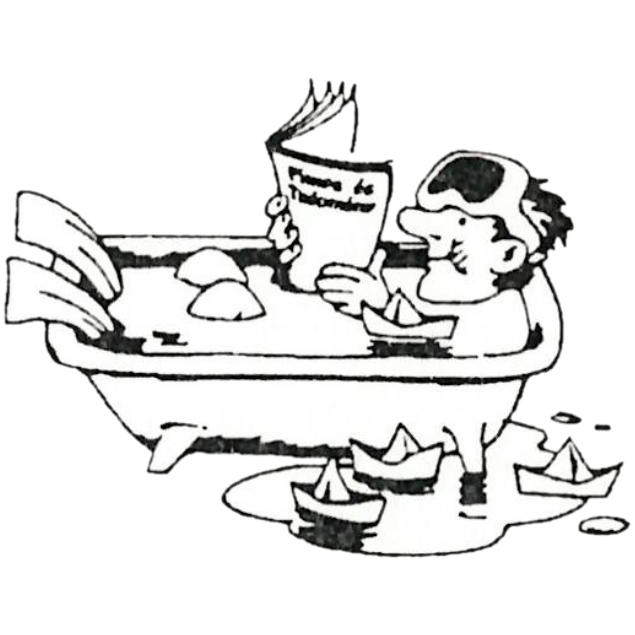

+++
title = 'Készüljünk az érettségire/felvételire!'
type = 'articles'
kicker = 'Matematika és fizika feladatok'
date = 1992-05-05
author = 'Szekendy Alajos, Kárpáti Csaba'
description = ''
weight = 70
+++

{.align-right}

## Matematika feladat


I. x2+log3x=38




II. y3-197·y2+10979·y=144343


Az I. egyenlet pozitív egész megoldását váltsuk át kettes számrendszerbe. Alkalmazzuk a következő megfeleltetést:

0:=∪  1:=—

Egy ma már nem élő költőnk írt először ilyen versformában. A költő képe megtalálható az egyik gimnáziumi tankönyvben. Nyissuk ki itt a könyvet, majd oldjuk meg a II. egyenletet! Emeljük négyzetre a költő halálának és születésének évét, s vonjuk ki egymásból őket! Vegyük az így kapott számnak a II. egyenlet gyökei szorzatával való osztása után adott maradékát, s lapozzunk vissza ennyi oldalt. Mi a furcsa mindhárom fegyvert tartó figurában?

(A fenti feladat Szekendy Alajostól származik)

_A megoldás megtalálható a [III. évf., 1-7,2 számban](../../2022-issue-1/három_balkezes_huszita/)_

## Fizika feladatok

1\. Egy gk. vezető vagy gyorsít, vagy 60 km/h-val halad. Egy piros lámpától 30 m-nyire állunk, indulástól számítva 4.5 s alatt teszi meg a távot. Mennyi lenne ez az idő, ha 60 m-nyire állnánk? (ábrázold v;t rendszerben) (Tfh. nem gyorsul fel 60-ra 30 m-en)

2\. Egy kocka élei és két szemben levő oldalán az átlók 1mm² vastag rézvezetékből lettek építve. Az élhossz 6.25 m. Az átlók metszéspontjaira 10V-ot kapcsolva mekkora lesz a) 20 b) 120 fokon az áramerősség (kockán kívül)? (adatok: FGVTBL.195.oldal)

3\. Homorú tükör félgömb, sugara 8 cm. A szimm.tengelyen 6 cm-re a középponttól fényforrás. A félgömbre lehet-e gyűjtőlencsét tenni úgy, hogy a kijutó fény párhuzamos nyalábokból álljon? f(lencse)=?

4\. Pisti azt állítja, hogy az orvosi szobában az oltáskor a preparátum felszippantása közben a folyadék forrt a fecskendőben. Pali szerint ez képzelődés, hiszen csak 20 fok volt a szobában, és ez nem egy varázsfolyadék, hisz előtte sem forrt. Kinek lehet igaza? Hogyan győznéd meg őket a te igazadról?

5\. Adott két jól egymáshoz illesztett lejtő, a fenti és lenti hajlásszög 15 és 75 fok. Egy-egy 20 kg-os fatömböt teszünk a lejtőkre. (μ=0.3) A fatömböket fonallal kötjük össze, a fonalat 2 kg tömegű 0.1 m sugarú csigán vetjük át, úgy rögzítve azt, hogy a két fonálszakasz párhuzamos legyen a lejtőkkel. A fonal nem csúszik meg a csigán. Az elengedéstől számítva hány s alatt lesz az alsó test 1 m-rel lejjebb?


6. Mekkora a keletkezett röntgensugár hullámhossza, ha a felgyorsított (becsapódó) elektron sebessége 0.75c és a mozg. energ. 50%-a alakult a röntgensugár fotonjának energiájává? Mekkora volt a gyorsítófeszültség? (0.75c-nél mel=1.5·10-30 kg)



(Kárpáti Csaba összeállítása)
