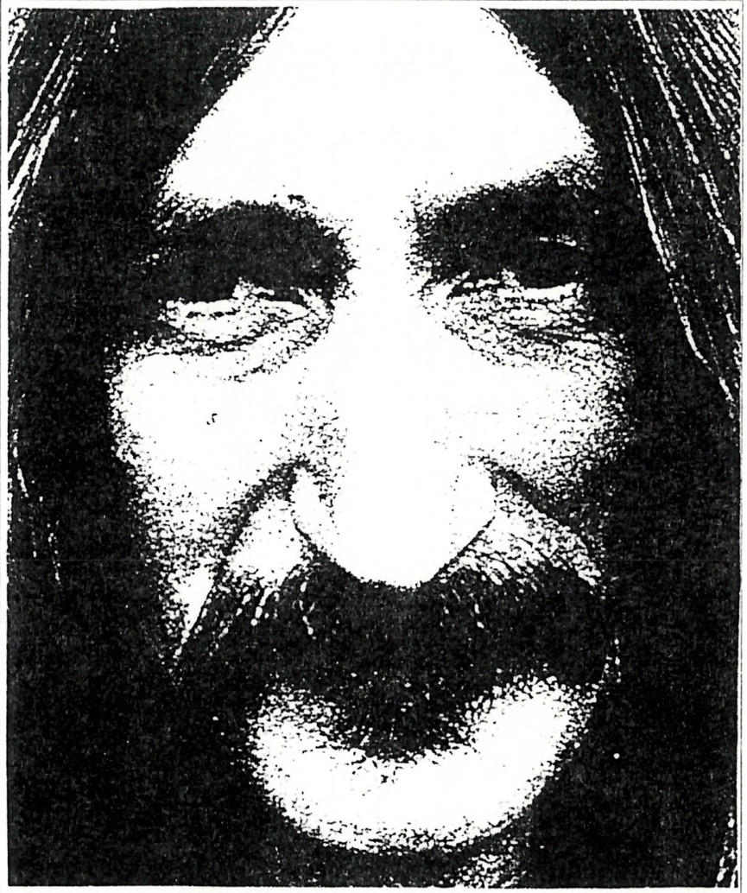

+++
title = 'Waszlavik Petőfi Velorex Gazember László'
type = 'articles'
kicker = 'Kultúra'
date = 1992-05-05
author = '<Tivadar>'
description = ''
weight = 40
+++

### [Egy rózsaszínű káddal...]

{.align-right}


Egy rózsaszínű káddal robogok a körúton\
Mögülem integet a medve\
Előttem fut át az ördög az úton:\
– Hahó, bojtos az állatkert merre?\
A vidámpark fényein hátul repülök,\
Míg Caesar pezsgőt bont a hold teraszán.

Oké, bemegyek az állatkertbe\
Fölöttem egy kalitka, jobbra, balra ketrec,\
De középen Nero horkol, [Hrrr]\
Megpiszkálom egy mogyoróbottal.\
A vidámpark fényein hátul repülök,\
Míg Caesar pezsgőt bont a hold teraszán.

Befutok magamba, elnyomok egy gombot,\
Napoleon sakkozik, rádobok egy rongyot\
Mögöttem épp Julius Caesar Nerot hozza,\
[Uraim,] önöket a legjobb irány vezeti a Holdra!

( A szöveg audiofelvételek nyomán készült; hitelessége nem bizonyított. )




Azt hiszem, nem kell hangsúlyoznom, hogy igencsak kemény dióba vágja baltáját az, aki Waszlavik Petőfi Velorex Gazember László fenti versének elemzésére vállalkozik. A világ- és magyar irodalom magabiztos nem ismeretében bátran kijelenthetem, kevés ilyen bitang jó vers létezik. (Ennyi rizsa talán elég is, lássuk a költeményt!)

A vers indításáról sokan és sokfélét mondtak már, legtalálóbban azt hiszem Szekendy Alajos irodalom és egyéb történész fogalmazott ilyeténképpen: 'A vers erős felütéssel kezdődik.' Ezután rögtön elemi erővel jeleníti meg a költő a nevetséges külsőségek között pusztulása felé robogó emberiséget: a versben rendkívül hangsúlyos helyen (az első sor végén, mintegy a vers szimmetriatengelyén kívül) elhelyezkedő körút-élmény pedig a művész ciklikus történelemszemléletére utal. Az itt megjelenő lírai én - amely az emberiséggel azonosítható - mögött integető medve a múltat szimbolizálja, világosan megfigyelhető, hogy a művész tudatosan felvállalja szamojéd örökségét, mikoris a medve a sámánok, sőt az egész törzs totemállata volt. (Egyes értelmezések szerint a mögöttem integető medve az elmúlt 40 évben hazánk területén állomásozó külföldi csapatokat szimbolizálja - a távozóban még visszaintő orosz medve alakjában. Valóban, e sorok jelentése felfogható így is: az igazán nagy vers ismérve az, hogy mindenki számára valami mást, valami újat mond.) Visszatérve tehát előbbi gondolatmenetünkhöz: az előttünk álló jövő már keresztény, mintegy európai motívumokkal telítődik: az előttünk átfutó ördög világos intés az emberiség számára: előbb-utóbb rossz vége lesz ennek a szörnyű robogásnak. És valóban: az emberiség célja az elállatiasulás, a fásult örömökbe, látszólagos vidámságba, pusztító alkoholmámorba merülés. Itt jelenik meg a versben két jelkép, melyek fontosságára nem lehet kellő hangsúlyt fektetni: a Hold-motívum, amely a költő más verseiben is rendkívül fontos szerepet játszik, illetve Caesar alakja - aki a továbbiakban is fontos szerepet játszik majd. Igen, Caesar, aki tudvalevőleg a világtörténelem egyik legtudatosabb elméje volt, itt a halálba farsangoló holdkóros őrültként jelenik meg, miközben a vidámpark hamisan csábító reflektorai kísérteties fénybe vonják az álltkert hideg rácsait. Költőnk repülve, egy pillantással fogja át ezt a képet, majd belép az állatkertbe, ahol a rácsok közt alvó Nero ismét az emberiség szimbóluma: a kalitkába zárt őrült (másodállásban a világ ura). Poétánk megpróbálja fölébreszteni, rádöbbenteni a valóságra, mely tevékenységéhez kizárólag ősi, természetes eszközöket használ (mogyoróbot). Aki ezt a versszakot megérti, tisztában lesz WPVGL minden tevékenységével, élete céljával: a természethez visszanyúlva (Ő is természethű, sőt Kelet-Ázsia is stimmel!) tehát a természet segítségével ráébreszteni az emberiséget a jelenlegi helyzet kilátástalanságára, valamiképpen változásra bírni az embereket. A visszatérő refrén azonban jelzi a feladat nagyságát: hiába minden erőfeszítés, Caesar (az emberiség magát tudatosnak hívő része) továbbra is őrültként (lunatic) tobzódik.

Nincs más hátra, mint a rezignáció: a belfelé fordulás, de előtte az elgépiesedés elleni tiltakozásként még szinte cigarettacsikként nyomja el korunk gép-szibólumát, az első útjába kerülő gombot. A világ már teljesen kifordult sarkaiból: Napóleont látjuk sakkozni, aki bár korának egyik legjobb sakkjátékosa volt, mára az őrület szimbólumává degradálódott (gondoljuk csak meg: nincs olyan magára valamit is adó bolondokháza, ahol ne volna legalább egy Bonaparte). Mögöttünk (a művész szimbolikája szerint itt elsősorban időbeli dimenzióra kell gondolnunk), szóval mögöttünk pedig bekövetkezett, amitől eddig is féltünk: az emberiség (színleg) még értelmes része karonfogva közeledik a nyíltan őrült Néróval - innét már nincs visszaút!

Ennyit erről. Igaz, hogy eme versről köteteket lehetne írni, elégedjünk meg most ezzel a rövidke eszmefuttatással. Aki pedig e verssel kapcsolatban többre kíváncsi, és tudásszomjának hatalmas tengerében csak egy csepp volt e kis iromány, annak egy tanácsot tudok adni: fogjon hozzá maga is a vers értelmezéséhez és elemzéséhez, hiszen nem kell hozzá más, csak egy kis logika (jól tudjuk: mindenkinek van, plane tagozatos osztályban), valamint nem árt, ha néha használunk néminemű csontdobozt is (szintén megtalálható mindenkinél). Sok sikert!


