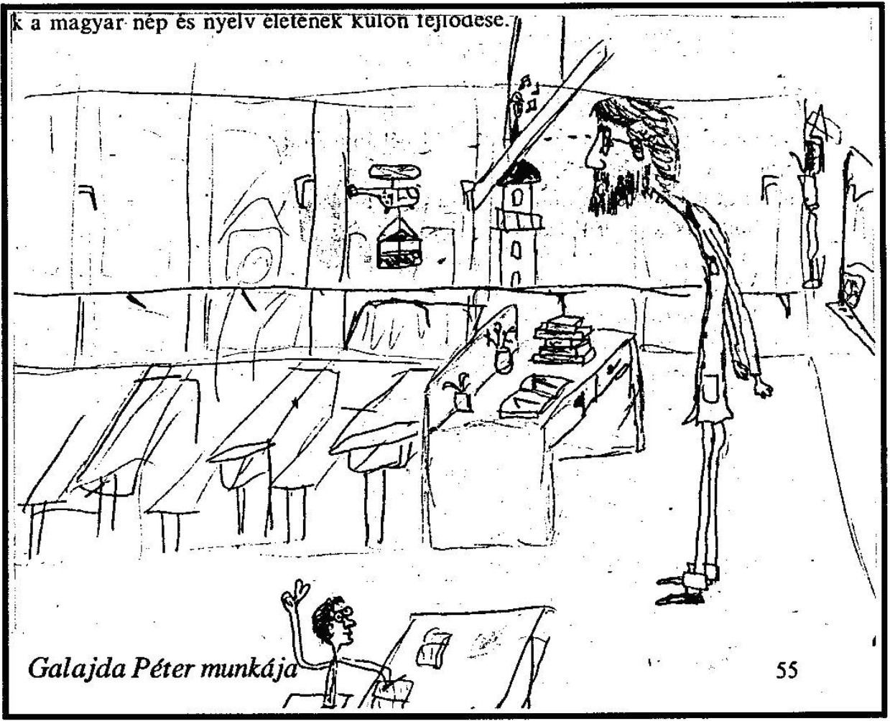

+++
title = 'Így élt Li Taj-po'
type = 'articles'
kicker = 'Kultúra'
date = 1992-05-05
author = ''
description = ''
weight = 60
+++



Li Taj-po; Li Po (névváltozat); Csing-lien csu-si (névváltozat); (Szubaj, ma Tokmak, SZU, Kirgiz SZSZK, vagy Csongming, Szecsuán tart., 699, ill. 701 - Tangtu, ma Tajping, Anhuj tart., 762): kínai költő.
Hagyományos életrajza igen sok felnagyított és legendás elemet tartalmaz, amelyek azonban nem hitelesek. Annyi bizonyos, hogy Li Po 705-től 720-ig Csangmingben nevelkedett. Már fiatalon feltűnést keltett verseivel.
Élethivatásának tekintett költői tevékenysége mellett alig felserdülve azt a sajátos, vándor, kóbor életformát választotta, amely a hagyományos kínai társadalomban a patriarchális-konfuciánus renddel megbékélni nem tudó nagy egyéniségek és különcök megszokott életvitele volt.
Így 720 táján remeteségbe vonult egy barátjával a Csiangming környéki hegyekbe, madarakat szelídített. A kor felfogása szerint ez a magatartás kiváló képességekre vallott, a helybeli mandarin a császári udvar szolgálatába is ajánlaná, de Li Po és társa ezt nem fogadta el.
Ezután évekig Kelet-Kínában kóborolt mint "kóbor lovag", azaz vándor igazságtevő, aki hagyományosan vállalta a vérbosszúk végrehajtását az arra képtelenek helyett. 726-ban nősült meg először. Ekkor már híre van mint költőnek és mint az ekkor divatos, a kötetlenséget, a mámort, a misztikát, a természet szépségeit kedvelő taoista életfelfogás talán legkövetkezetesebb képviselőjének.
Ebben az időben több ízben próbál hivatalos álláshoz jutni a mandarinvizsgák letétele nélkül, de sikertelenül. Valószínűnek látszik különben, hogy egész életében pártfogótól pártfogóhoz, barátokhoz vándorolva csak költészetéből és személyes varázsa keltette hírnevéből élt.
742-ben megmászta a Tajsan hegyet, Kína legszentebb hegyét és számos verset írt róla. Egy taoista barátja ajánlására 742 őszén a császári udvarba hívták Csanganba (ma Hszian), a Hanlin Akadémia tagja lett. A hagyománnyal ellentétben a valóságban itteni állása jelentéktelen, más udvari költőkkel együtt az udvari ünnepségek számára írt verseket, dalszövegeket.
Az udvarnál remélt karrier azonban nem következett be, csalódottan hagyta el a fővárost. Ez idő tájt nyerte el egy taoista kiválóságtól ünnepélyes szertartás keretében a taoista beavatottak talizmányát.

(Ekkor már harmadik felesége családjánál élt.) Feltehetően ezutánra, 745 és 759 közötti észak-kínai időzésére esik nagy alkotó korszaka, amikor legnagyobb verseit írta. 756-ban negyedszer is megnősült. Politikai okokból (pártfogója kegyvesztett lett) 758-ban száműzték, 759-ben kegyelmet kapott, majd Vucsangba ment, ahol régi barátjára, Csang-csien szerzetesre rábízta nála levő verseit.
Ezek későbbi sorsáról nem tudunk. 761-től Tangtuban időzött, itt halt meg betegségben. A vendéglátójára, Li Jang-pingre bízott versei maradtak fenn.

A klasszikus kínai irodalomban a hagyomány a legnagyobb költők közé sorolja, ha ugyan nem a legnagyobbnak tartja. E rangját legalább annyira köszönheti már korán legendákkal körülvett egyéniségének, mint költészetének. Élete és költészetének állandó tematikája egy ember magatartásába sűrítve mindazt felfokozottan tartalmazta, amiben a régi kínai világ írástudói - belefáradva a mindennapi élet konfuciánus prózaiságába - menekülést, kiutat kerestek.
Talán az egyetlen régi kínai költő, aki sohasem kereste boldogulását a konfuciánus tudományok elsajátítása, a hivatali vizsgák útján. Fölényes felülemelkedése, kívülállása minden társadalmi kötöttségen sokak számára századokon át az emberi szabadságnak a régi Kína viszonyai közt egyedül lehetséges irigyelt, csodált és megismételhetetlen példaképét jelentette.

Magyarul olvasható művei: Li Taj-po versei (gyűjt. kiad., 1961); Li Taj-po - Tu Fu - Po Csu-ji versei (1976) / A Világirodalmi lexikon alapján/

Megjegyzés: a Világirodalmi lexikon kiadásakor még létezett a Szovjetunió és a Kirgiz SZSZK. Az itt szereplő idejétmúlt adatokért a P&T nem vállal felelősséget.



