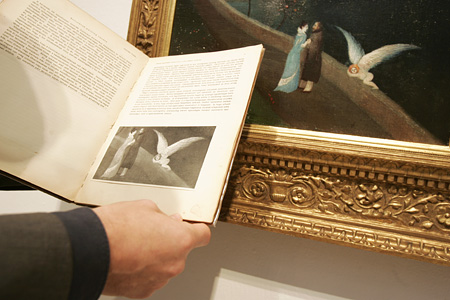

+++
title = 'Az ismeretlen Csontváry'
kicker = 'A kirándulásfüzet hiányzó oldalai'
type = 'articles'
date = 2022-09-10
author = 'Szekendy Alajos'
description = 'Mindannyiunknak volt _kirándulásfüzete_, sőt, aki okos, egy életre eltette. Az elsős pécsi kirándulásunk kapcsán Horváth Géza tanár úr alaposan kiképzett minket a pécsi látnivalókból, lerajzoltuk a Székesegyházat, letapsoltuk a Káptalani Levéltár ablakait. A csúcspont mégis a Csontváry Múzeum volt a festményeivel, melyeket le is rajzoltunk hol csak vázlatosan, hol egészen részletesen színes ceruzával. A füzetnek kétségkívül ezek a leglátványosabb részei, és most, harmincnégy év múltán a modern technikát segítségül hívva megpróbálunk hozzátenni néhány plusz oldalt.'
image = 'cover.jpg'
weight = 100
+++

Mindannyiunknak volt _kirándulásfüzete_, sőt, aki okos, egy életre eltette. Az elsős pécsi kirándulásunk kapcsán Horváth Géza tanár úr alaposan kiképzett minket a pécsi látnivalókból, lerajzoltuk a Székesegyházat, letapsoltuk a Káptalani Levéltár ablakait. A csúcspont mégis a Csontváry Múzeum volt a festményeivel, melyeket le is rajzoltunk hol csak vázlatosan, hol egészen részletesen színes ceruzával. A füzetnek kétségkívül ezek a leglátványosabb részei, és most, harmincnégy év múltán a modern technikát segítségül hívva megpróbálunk hozzátenni néhány plusz oldalt.

Az elmúlt harminc évben árveréseken előkerült 6 db korábban elveszettnek hitt vagy nem nagyon ismert Csontváry-festmény. Sajnos mind magántulajdonba került, így továbbra sem lehet osztálykirándulást szervezni a megtekintésükre, de legalább már jó minőségű fotók elérhetők. Ezek viszonylag kis méretű festmények, ám mind hordozzák Csontváry művészi eszközeit, és mutatják zsenialitását.

Kizárólag az ismétlés kedvéért:


**Csontváry művészi eszközei, avagy „a természet és a mindenség életre keltésének módszerei”:**

 * Ellentétes színek: pl. kék-piros harmonikusan egészítik ki egymást
 * Fokozás a színekkel: pl. a zöld nem egyformán zöld, sötétzöld, majd világosabb, szinte sárgás árnyalatba megy át
 * Foltfestés: nagy, egyszínű felületek használata, ezeken lehet fokozás is
 * Rovátkolt színek: apró pontokból vagy vonalakból álló színfelület, melyek távolabbról egyszínű felületnek látszanak
 * Lebegő színek: fátyolszerű, finom színek
 * Múlt idejű színek egyidejű szerepeltetése: a táj egyes részeinek legjellemzőbb színét választja ki a különböző napszakok közül, olyan színek kerülnek a tájon egymás mellé, amelyek megvannak a valóságban, de soha nincsenek egyszerre jelen



**Csontváry színvilága, hiszen „a színeknek Csontvárynál kozmikus jelentősége van”:**

 * Fekete és fehér: a nemlét színei, a fehérből még fakadhat lét, a feketéből már nem
 * Sárga: a barátság, a meghittség, közelség színe, koncentrikusan vonz
 * Kék: az intelligencia, kifinomultság színe. A kék szín koncentrikusan távolít, ezek a tulajdonságok nehezen szerezhetők meg, az ég is messze van.
 * Zöld: a kék és a sárga keveréke, a természet színe
 * Piros: a hús-vér élet jelképe
 * Barna: piros és fekete keveréke, a földközelség színe
 * Szürke: fekete és fehér keveréke, átmenet színe a lét és nemlét közt
 * Lila: az enyészet színe
 * Narancs: ifjúság színe


Lássuk hát a képeket felbukkanásuk sorrendjében, az első mindig az eredeti, majd a kirándulásfüzet-verzió, ahogyan azt a szerkesztőség felhívására végül egyedüliként jelentkező Péter László barátunk változatos eszközhasználattal rekonstruálta.

**1\. Szerelmesek találkozása (1902)**



A kép korszakhatárt jelöl Csontváry művészetében, az útkeresés lezárult, és művészete érett korszakába lépett. Az állandó motívumokon túl, mint a kék ég, komor hegyek, kanyargós út, magányos fák, egy szokatlanul bensőséges jelenetet látunk, egy szerelmespárt az úton. A festő azon ritka képeinek egyike, ahol érzelmeket látunk, a pár nem szenved önmaga magamagányosságától, megtalálták boldogságukat. A kőfalon alvó szárnyas angyal mintegy óvja a szerelmespárt a mellettük tátongó szakadéktól. Érdekes motívum a szerelmesek fölött lebegő pókháló, ami egyszerre jelent biztonságot és kelt baljós érzetet, továbbá az utat szegélyező három életfa, ami az élet szakaszait szimbolizálja: fiatal fa, dús gyümölcsöket termő fa, kiszáradt fa. A férfi minden bizonnyal maga a festő, a nőalak pedig a megtalált tökéletes, intelligens szerelem, amire a légiesen kék ruha (intelligencia színe) is utal. Egyes elemzők szerint a nőalak egy híres táncművész, akinek művészete nagy hatással volt a festőre.

A kép története regénybe illő: mindössze egy 1931-es monográfiában szerepelt egy fekete-fehér fénykép a három figuráról, de senki nem tudta, hol a kép, mígnem 2006-ban a tulajdonos család aukcióra bocsátotta, ahol rekordáron, 230 millióért kelt el (plusz 20% aukciós jutalék).

**2\. Traui tájkép naplemente idején (1899)**



A művész korai, kísérletező műve remek példája a múlt idejű színek egyidejű ábrázolásának. Az állandóan visszatérő motívumokat (kék ég, hullámos hegyek, öböl, híd, kanyargó út) a művész megfigyelte nappal, holdfénynél, esőben, télen, nyáron stb., és mindegyiket a legjellemzőbb színeivel festette meg. A kisméretű (34 x 66 cm) képet a festő lánytestvére ajándékozta el Csontváry halála után, majd végül 2012-ben aukcióra bocsátották, ahol ismét rekordot döntött az eladási ár: 240 mFt plusz jutalék.

**3\. Olasz halász (1901)**



Csontváry 1901-ben a Taormina óvárosát keresztül szelő Corso Umbertón végigsétálva négy képet festett, és ennek a képciklusnak első darabja az Olasz halász. Itt is visszaköszönnek az ismerős motívumok, a kép kompozíciója (boltív alatt lépcső) nagyon hasonlít két korábbi képére (Ódon boltozat; Az ifjú festő – mindkettő szerepelt a kirándulásfüzetünkben). A képen a művész pusztán a foltfestést és a színekkel való fokozást használva mesteri fény-árnyék hatásokat ér el, miközben a lépcső íve, a falak, az árnyékok mind az apró halász figurájára vezetik a tekintetünket. A halász nyugalmat árasztó, természettel harmóniában élő bölcs öregember, ruhájának színei kék és zöld, az intelligencia és a természet színei.

A képet csak egyszer, 1936-ban láthatta a közönség, majd évtizedekre nyoma veszett, a közvélekedés szerint hadizsákmányként a Szovjetunióba került. De valójában túlélte a háborút, és 2017-ben került kalapács alá. Az előzetesen várt rekorddöntés ezúttal elmaradt, 140 mFt-ért kelt el, plusz jutalék.

**4\. Hídon átvonuló társaság (1901)**



Ismét tipikus Csontváry-tájat látunk (kék égbolt, fák, öböl, kanyargós út, íves híd), melyet titokzatos mesebeli álmodozó figurák, vadászok, utazók, lovasok, köztük egy amazon, bohócok, gyermekét karjában tartó anya, tétova férfiak népesítenek be. A bonyolult szimbolika igen tág értelmezésnek hagy helyet. Az alakok nyugalmat sugároznak, harmóniában élnek a természettel. Az uralkodó szín a kék, a bölcsesség és intelligencia színe, és a zöld, a természet színe.

Ez a tétel kilóg a listánkról, mert valójában egyáltalán nem ismeretlen Csontváry-kép, de mivel magántulajdonban van, csak ritkán látható a nagyközönség számára. Már 2006-ban is árverésre került, és az akkori rekordot jelentő 180 mFt-ért kelt el, majd 2021-ben ismét aukciózták. A végső árat ekkor nem hozták nyilvánosságra, de a sajtóhírek szerint ismét új hazai rekord született. A képet volt alkalmam megtekinteni az árverést megelőző kiállításon. Hangulatában már a későbbi remekműveket idézte – Mária kútja Názáretben, Tengerparti sétalovaglás –, de a táj, a háttér, a híd köveinek elnagyoltsága miatt befejezetlen festmény érzetét keltette.

**5\. Piros ruhás gyermek (1894)**



 Az életmű egyik legrejtélyesebb darabja, nem tudni, kit ábrázol, abban sincs egyetértés, kisfiú-e vagy kislány. A gyermek átható, igéző szemei és a túlfokozott, szinte már misztikus piros-fekete színek rendkívüli vonzerővel ruházzák fel az alkotást. Többek szerint a Csontváry legkorábbi korszakából származó képen a festő egyik nővére látható, aki tragikus körülmények között tűzvészben hunyt el 1863-ban. Egy másik, igen eredeti elképzelés szerint a festő valójában saját magát ábrázolja. A XIX. sz. végén Raffaellónak tulajdonítottak egy hasonló képet, melyen a saját fiát festette le, Csontváry példaképe pedig Raffaello volt. Eszerint Csontváry ugyanúgy festette meg a hatéves kori önmagát, mint Raffaello a hatéves fiát.
A sokáig teljes ismeretlenségbe burkolózó kép 1994-ben bukkant fel egy hazai magángyűjteményből, majd ezt követően az életmű egyik legismertebb és legtöbbet publikált darabja lett. A képet 2022 márciusában lehetett megtekinteni négy napig egy budapesti művészeti vásáron, majd az ezt követő aukción talált új tulajdonosra. A végső árról sajnos nincs nyilvános információ. Erre a vásárra nem sikerült eljutnom, mivel épp coviddal töltöttem a napjaimat, de van még rá esély, hogy a jövőben a nagyközönség újra láthassa valamikor a mesterművet.

**6\. Titokzatos sziget (1903)**



Csontváry legtitokzatosabb képe, az önálló mítoszteremtés mesterműve. A háborgó tengeren, hajók számára szinte megközelíthetetlenül egy napfényes, furcsa épületekkel és figurákkal benépesített, nyugodt szigetet látunk. A sziget többjelentésű ősi szimbólum, jelképezi a világtól való elvonulást, a „boldogok szigetét” vagy a holtak végső nyughelyét, de a képen akár Prospero szigete is lehet Shakespeare Vihar című drámájából. Csontváry értelmezésében az egész univerzum egyetlen nagy élőlény, ezen a szigeten megvalósul a természet, az épített környezet, az ember, az élővilág és minden egyéb lény közös harmóniája. Színeiben is a piros (hús-vér élet), a zöld (természet) és a sárga (meghittség, barátságosság) dominálnak.

A festmény sokáig lappangott, majd 1977-ben a BÁV-aukción mindössze 85 eFt-ért értékesítették, mivel gyenge színvonalúnak tartották. Ezt követően ismét évtizedekre eltűnt a közönség elől, és csak 2003-ban állították ki ismét. Több tulajdonosváltást követően 2021 decemberében bocsátották újra aukcióra, és minden korábbi rekordot megdöntve 460 mFt-tal lett a legdrágábban tulajdonost cserélt magyar festmény.

Ezt a képet is lehetőségem volt élőben megtekinteni az aukció előtt, maradandó élményt adott. Gyakran jellemzik Csontváry egyes képeit „az egyik legtalányosabb” jelzővel, de mind közül ez a legtalányosabb. Hosszasan lehet nézegetni a furcsa figurákat és épületeket, az értelmezési lehetőségek száma végtelen. A festmény elképesztően élénk színeit semmilyen fotó nem adja vissza – ha valamikor még ki lesz állítva, mindenki feltétlenül nézze meg!

