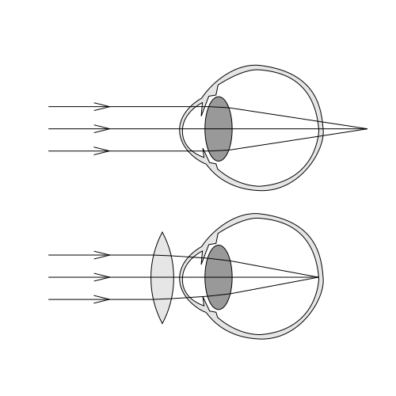

+++
title = 'Derűlátás vagy borúlátás'
type = 'articles'
date = 2022-09-10
kicker = 'Tudomány'
author = 'Pulai András olvasói levélben feltett kérdésére Kárpáti Csaba adja meg a választ'
description = ''
image = 'cover.png'
weight = 130
+++

Kedves Fiatalok!

Mint tudjuk, a szem fordított képet lát, és az agyunk gondoskodik róla, hogy a jól megszokott irányokat érzékeljük. Egy lelkes kutató még azt is kipróbálta, hogy ez pár nap alatt megfordítható egy szemüveg segítségével, majd azt levéve ismét visszafordul.

{.align-right}

Azt is tudjuk, hogy a szemünk nagyon jól megszokja a különböző használati módokat: mobilozást, laptopozást, autóvezetést mindenféle tükrök használatával. Ha nem ügyelünk, ellustul, elfárad. Tornáztatnunk-pihentetnünk kell, mert akkor működik tökéletesen.

Kíváncsi vagyok, kinek mit mondtak az optikusok. Engem azzal leptek meg, hogy 40 éves kor felett javulni fog a mínuszos szemem. Sikersztori. Pozitív üzenet. Ezzel szemben mindenhol azt olvasom, hogy akinek semmi gondja nem volt, 40 és 60 között megismerkedik a látási problémákkal, főleg a közellátásban. Eleinte délután és este, majd később egész nap.

Ez a folyamat, amelynek során a szem nem tud eléggé domború lenni, többféle szemüveggel,
szemműtéttel ellensúlyozható. Érdekes módon semmiféle természetes gyógymód nem található a neten, ekkor már mindenki borúlátó. Az egyéb szembetegségekről pedig jobb nem is beszélni.

Remélhetőleg mielőbb felfedezik az örök fiatalságot visszaállító kapszulákat, és megmenekülünk!

