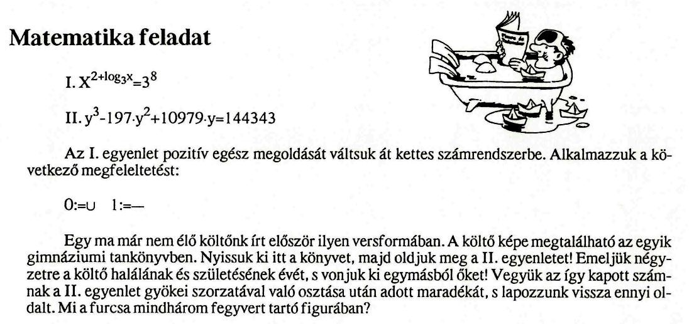
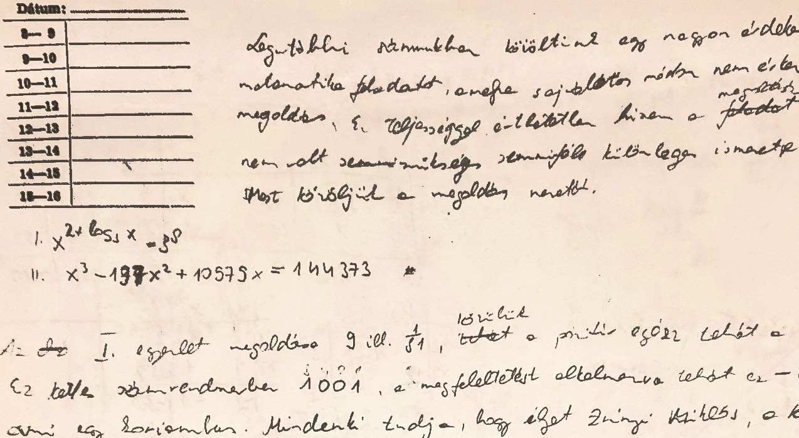

+++
title = 'Három balkezes huszita egy harci szekéren'
type = 'articles'
kicker = 'A matematika érettségi-felvételi felkészítő feladat megoldása*'
date = 2022-09-10
author = 'Szekendy Alajos fejtörője'
description = 'Legutóbbi számunkban közöltünk egy nagyon érdekes matematika feladatot, amire sajnálatos módon eddig nem érkezett megoldás. Ez teljességgel érthetetlen, hiszen a megoldásához nem volt szükség semmiféle különleges, spec. matematika tagozaton nem tanított ismeretre. Tovább nem várva a beküldőkre, közöljük a helyes megoldást.'
image = 'cover.jpg'
weight = 80
+++

Legutóbbi számunkban közöltünk egy nagyon érdekes matematika feladatot, amire sajnálatos módon eddig nem érkezett megoldás. Ez teljességgel érthetetlen, hiszen a megoldásához nem volt szükség semmiféle különleges, spec. matematika tagozaton nem tanított ismeretre. Tovább nem várva a beküldőkre, közöljük a helyes megoldást.

Ez volt a feladat:

Az I. egyenlet megoldásai a 9, illetve az 1/81, ezek közül csak a 9 pozitív egész. Ez kettes számrendszerben 1001, amire a megadott megfeleltetést alkalmazva: — ∪ ∪ —, ami egy korijambus. Mindenki tudja, hogy ilyet Zrínyi Miklós, a költő-hadvezér írt először magyar nyelven. Az ő képe két gimnáziumi tankönyvben is megtalálható^**^: másodikos irodalom, illetve történelem, de a továbbiakban egyértelműen kiderül, hogy a történelem könyvre gondoltunk, mert az irodalom könyvben nem lehetne elegendőt visszalapozni.

Nyitva van a könyvünk a költő-hadvezér képénél a 270. oldalon, és rögtön le is olvashatjuk születésének és halálának évét (1620–1664), ha esetleg nem tudnánk fejből. Ezek négyzetének különbsége 144 496.

A II. egyenlet megoldásai (lehet, hogy ezt nem sikerült megoldani?!): 19, 71, 107, melyek szorzata 144 343. 144 496 maradéka a 144 343-mal való osztás után 153. Ha visszalapozunk ennyi oldalt (270-153=117), a 117. oldalon van nyitva a könyvünk. Itt a lap alján egy képet látunk^***^ egy XV. sz. végi huszita harci szekérről.

Ha jobban megvizsgáljuk a szekéren álló embereket, észrevehetjük, hogy mindegyik figura balkezes. Valószínűleg fordítva került be a kép a könyvbe, ezért állt elő ez a furcsa helyzet, mert gondoljunk csak bele: három balkezes huszita egy harci szekéren...?!?!?!

^*^ A megoldás már 1992-ben készen volt, kéziratban előkerült, minimális változtatásokkal közöljük.\
^**^ Az 1992-ben használatban lévő tankönyvekről van szó.\
^***^ Sajnos nem sikerült másodikos történelem könyvet fellelni, így képet nem tudunk mellékelni, esetleg majd a P&T következő számában.

