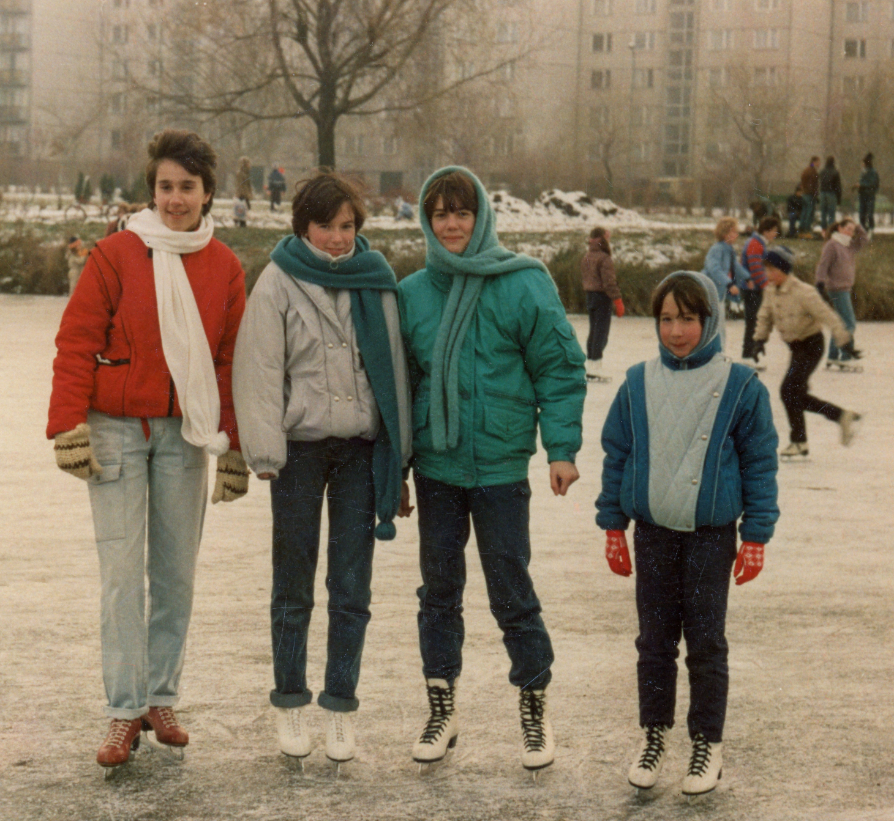
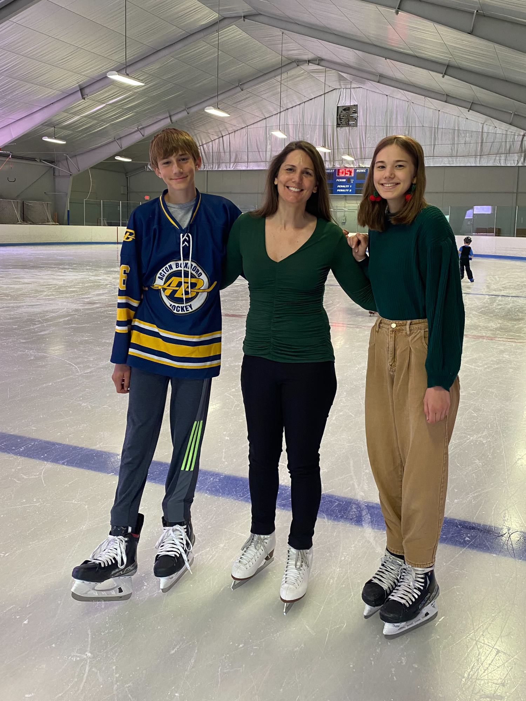

+++
title = 'Jégvarázs'
type = 'articles'
date = 2022-09-10
kicker = 'Így sportolunk mi I.'
author = 'Damján Dóra beszélgetése Sitkei Edittel'
description = ''
image = 'cover.jpg'
weight = 160
+++



**Próbálom felidézni, mikor hallottam tőled, hogy ezt a sportot űzöd. Talán akkor, amikor írtam neked, hogy van-e régi fotód az osztályról, és a válaszleveledben érdeklődtél, hogy vagyok, és írtál pár szót magadról és a családodról. Én a téli sportok megszállottja vagyok, így rögtön felkaptam a „korcsolya” szóra a fejem. Hogy jött?**

{.align-left}

Gyerekkori álom volt. Ajkán volt egy mesterséges csónakázó tó, télen oda jártunk a barátnőkkel. A pályán mindig ment a zene, nagyon jó hangulatban koriztunk. Ott már elkezdtem az alapokat tanulni, de mindig szerettem volna komolyabban foglalkozni vele. Réka lányom 5 éves volt, amikor a tőlünk 5 percre lévő műjégpályára elvittem oktatásra. Közben én szerencsére bekerülhettem a haladó gimnazista lányok csoportjába.

**Hát ezen nem csodálkozom. Milyen elemeket tanultatok a haladó csoportban?**

Mérlegsiklás, egyszerűbb forgások, ugrások már jól mentek.

**Te nem akartad a saját gyerekeidben önmegvalósítani magadat a sport terén? (Én többször próbálkoztam, hátha Emma megszereti a műugrást, miután nekem csak felnőttként volt rá lehetőségem.)**

{.align-right}

Valószínűleg benne volt ez is, de nem erőltettem, mert Rékáról két év után kiderült, hogy nem érdekli, és nem is tehetséges benne, ezért abba is hagyta. Helyette évekig gimnasztikázott, de azt is abbahagyta – jobban kedveli az olvasást és a digitális művészeteket. Más történt a fiam, Ádi esetében, akit három éves korában már én tanítottam meg korcsolyázni. Ő hokizni kezdett, és nagyon tehetséges benne. Két évvel ezelőtt, amikor tízéves volt, nagyon meghatódtam, amikor megköszönte, hogy annak idején megtanítottam korcsolyázni, és ezért ő most hoki bajnokságot nyerhetett a csapatával.

**Gratulálok! Nagyon klassz teljesítmény! Mi a csapat neve?**

Nem is tudom, nálunk a csapatnév annyira nem fontos, csak a városunkról van elnevezve, Acton-Boxborough.

**Te még mindig aktívan tanulod a korcsolyázást?**

Nem, abbahagytam.

**Ennek mi volt az oka?**

Egyszer egy hatalmasat estem. Féltem, hogy agyrázkódást kaptam, és komolyabb következményei lesznek. A tanfolyamot befejeztem, de továbbra is kijárok a jégre.

**Mire váltottál?**

Igazából nem váltottam, mert már húsz éve jógázom, és néha síelek.

**Akkor te is a téli sportok rajongója vagy! Hol szoktál síelni?**

Abszolút! New Hampshire-be járunk. Azért más, mint az európai pályák. Szoktam is mondani a gyerekeknek, hogy ha itt megtanultok, akkor bárhol tudni fogtok síelni, mert nagyon jegesek a pályák. Néha úszni járok még, megterhelő sportot nem űzök, csak olyat, amit élvezni tudok.

**Te mit gondolsz, a gimnáziumban volt lehetőségünk a sportolásra?**

Hát, én nem nagyon emlékszem, hogy lett volna. Aerobik biztos volt, arra jártam is. Te hogy emlékszel?

**Én még az aerobikra sem emlékszem. A mi gyerekkorunkban én azt éreztem, hogy a tehetséges sportoló gyerekeket támogatják, aki viszont hobbi sportot szeretne űzni, annak kevésbé volt erre lehetősége.**

A Lovassyban akkoriban nem ezen volt a hangsúly. Ajkán gyerekkoromban azért volt erre lehetőség – én például általános iskolában hobbiból jártam ritmikus gimnasztikára. Egyetlen egyszer, nyolcadikban jutottam el egy megyei döntőre, és képzeld el, hogy Straub Zsuzsi miatt csúsztam le a dobogós helyről… Ha jól emlékszem, a labdagyakorlatával bronzérmes lett, én pedig negyedik. Akkor még nem tudtuk, hogy a Lovassyban osztálytársak leszünk.

**Édesanyám lebeszélt a gimnáziumban, hogy menjek síelni, mert azt az egy hét kiesést pótolni nagyon nagy energia lenne. Erről mi a véleményed? A te szüleid hogy álltak a „tanulás a legfontosabb” elvhez?**

Én sem mentem, pedig már akkor tudtam síelni. Általános iskolában az ajkai síversenyen második helyezést értem el, az igazat megvallva azért, mert ketten tudtunk síelni a városban. Úgyhogy ezüstérmes síelő vagyok! De biztos vagyok benne, hogy az én szüleim sem támogatták volna az ilyen jellegű egyhetes távollétet.

**Harminc év alatt szerinted változott a szülők hozzáállása a sport fontosságához?**

Nem tudom, Magyarországon mi a helyzet, de Amerikában szinte átestek a ló túloldalára. Nagyon nagy hangsúly van rajta, még az egyetemi felvételibe is beleszámít. Az is biztos, hogy az én életemben fontos szerepet játszik a sport, a nevetésen kívül talán a legnagyobb stresszoldó számomra.

_Ezen a ponton leállítottuk a felvételt (rögzítettem, nehogy valami fontos információ kimaradjon), és elkezdtünk beszélgetni. Rengeteg közös témánk volt még a sporton kívül. Lehet, hogy valamelyikről egyikünk ír majd a_ Pimpa és Tudomány _legközelebbi számába. Nagyon jó, hogy már face to face tudunk egymással beszélni úgy, hogy földrészek választanak el minket egymástól._

