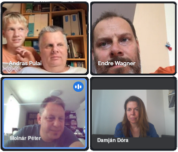
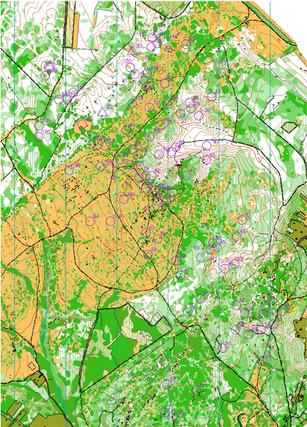
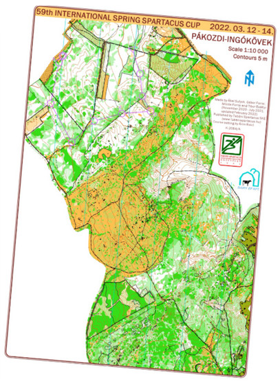
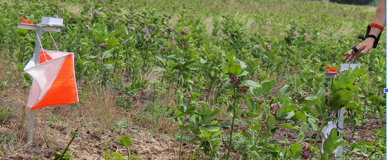
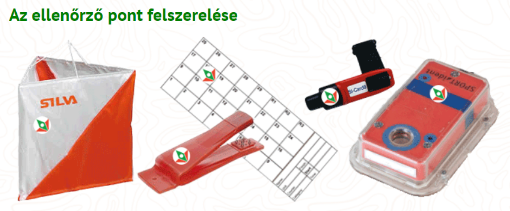
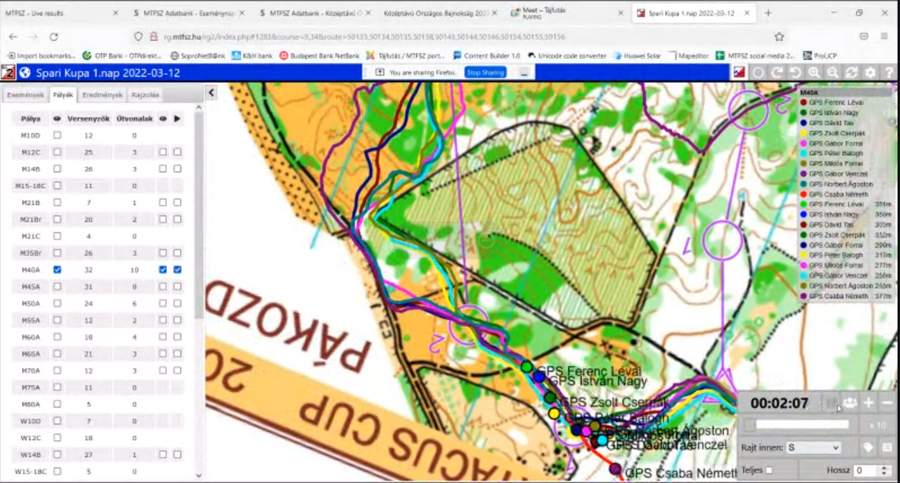
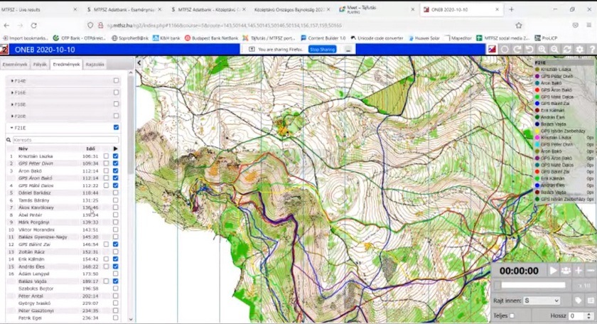

+++
title = 'Kengyelfutók'
type = 'articles'
date = 2022-09-10
kicker = 'Így sportolunk mi II.'
author = 'Damján Dóra beszélgetése Molnár Péterrel, Pulai Andrással és Wagner Endrével'
description = ''
image = 'cover.jpg'
weight = 170
+++

**Már gimis korunkban tudtuk, hogy Petinek szenvedélye a tájfutás, de ti, srácok, hogyan csöppentetek bele?**

**PA** A fiam elkezdett tájfutni. Amikor egy téli estén érte mentem, a tornateremben voltak. Az edző a kezembe nyomott egy térképet – igen, a tornateremről – és azt mondta, hogy amikor leülnek a gyerekek, próbáljam ki. Én meg kipróbáltam... Tavasszal pedig, amikor harminc éves lett a klub, csináltak egy háziversenyt Újpesten, a Farkaserdőben, amin szintén részt vettem. Innen jött az ötlet, hogy csábítsuk el Endrét Petivel egy igazi versenyre, meg akkor ott hátha koccinthatunk is.

**Mikor és hol volt a verseny?**

{.align-right}

**WE** 59. Tavaszi Spartacus Kupa, 2022. március 12–14. Pákozd, Ingókövek.

**Ki vehet részt egy ilyen versenyen?**

**MP** Nyílt, így bárki részt vehet rajta. Vannak nehezebb és könnyebb pályák is. A kezdő pályák lényege, hogy kedvet csináljanak azoknak, akik először próbálják ki. Itt általában utakon kell futni, ami a hétköznapi emberek számára is követhető.

**Hogyan zajlik egy ilyen verseny?**

**MP** A versenyzők bizonyos időközönként indulnak ugyanazon a pályán, hogy önállóan kelljen tájékozódniuk. A rajt pillanatában megkapják a térképet, amit már a saját versenyidejükből kell értelmezniük, és meg kell keresniük sorrendben a pontokat. Pontnak valamilyen objektumon kell lennie: ez lehet gödör, szikla, tisztás, ösvény. A pontot a terepen egy háromoldalú, 30x30 cm-es, átlósan osztott narancssárga-fehér bója jelöli.

**WE** A versenyzőknek a rajtkor kell értelmezniük a pályát, előre nem mondták el a térkép jelzéseit.

**MP** Én próbáltam nektek elmondani, mi mit jelent, pl. vadászles, szaggatott útvonal.

**PA** Én figyeltem is! A 6-os pont egy szikla, min. 1 méterre kiemelkedik. Na, ez nem igy volt, valaki betemette, így 10 percig nem találtam meg.

{.align-right}

**WE** Az 5-ös pontot nem találtam meg, mert letértem az útról. Az utolsó pont a szántóföldön volt, amit erősen kerestünk Pulussal, rajtunk kívül még két versenyző ott keresgette, mi meg sikeresen eltérítettük őket.

**MP** Az eredményeket utólag böngészve láttuk, hogy Pulus a 3-as pontnál megverte a győztest, a 6-osnál viszont 8 percet veszített. A versenyek után minden versenyző összes részideje az egyes ellenőrző pontokon fel szokott kerülni az internetre, így alaposan ki lehet elemezni, ki hol rontott vagy remekelt. Még ennél is plasztikusabb képet mutat, amikor a térképet és a pályákat töltik fel egy grafikus felületre, ahol mindenki berajzolhatja az útvonalát, vagy a profibbak a futóórájukból feltöltik a GPS tracket. A feltöltött útvonalak alapján pedig lejátszható egy animáció, amiben szimulálódik, hogy hogyan alakult volna a verseny, ha egyszerre rajtol mindenki.

**Az ellenőrző ponton mit kell tenni?**

{.align-right}

**MP** Az ellenőrző pont érintése hagyományos módon a magunkkal vitt papír alapú ellenőrző kartonra történő lyukasztással, vagy a napjainkban már nagyon elterjedt elektronikus pontérintő rendszer alkalmazásakor az ujjunkra húzott dugókával történik.

**WE** Chip. Petinek a bőre alatt van.

{.align-right}

**MP** Az én dugókám huszonkét éves, a rendszer hazai bevezetésekor vettem, azóta is hibátlanul működik. Ilyet ma már nem is lehet kapni. Jelenleg a negyedik generációjuknál járnak ezek a chipek, a legújabbak már érintés nélküli technológiával működnek: nem kell megállni a ponton, és bedugni a dobozba, csak egy fél méteres távolságon belül elhaladni mellette.

**Milyen helyezést értetek el?**

**WE** 6. lettem 27:05-ös idővel.

**PA** Én a 28. helyezést értem el 39:44-es idővel.

**MP** Azt azért tudni kell, hogy megverték pl. Gyurina Szabolcsot is, aki 31 évvel ezelőtt az első 14 éven aluliak számára rendezett magyar bajnokságot nyerte. Én egy nehezebb pályán 4. lettem 26:46-os idővel, ami a magamtól elvárt sebességen belüli.

**Milyen volt a sör?**

**PA** Ezen a versenyen rumoztunk, mert hideg volt. A gyerekek előtt azért ezt titkoltuk.

**MP** A tájfutók nem egy prűd társaság, és mivel a versenyek egyben szociális események is, eléggé megszokott az alkoholfogyasztás, a többnapos versenyeknek kimondottan fesztivál hangulata van. A legnagyobb hazai verseny a Hungária Kupa, ami ötnapos, ez akkor szokott a legjobban sikerülni hangulat szempontjából, amikor egy világvégi helyen 1000-1500 ember együtt sátrazik, esténként meg beül a sörsátorba. Legutóbb még egy országos bajnokságon is majdnem botrány tört ki, amikor délelőtt 11-re elfogyott a sör a büfében…

Ez egyébként egy több évtizedes polémia, hogy hogyan lehet a legjobb sportteljesítményt nyújtani az esti piálás után. Fiatalabb korunkban rengeteget kísérleteztünk a haverokkal, de nem sikerült egyértelmű mintát felfedeznünk. A sör lelassítja másnap az embert, a bortól nekem általában fáj a fejem, úgyhogy maradnak a tömények. Az viszont eléggé kétélű fegyver – vagy szárnyal az ember másnap, vagy fel se tud kelni. Tizenöt évvel ezelőtt egy mátrai versenyen tanultuk meg a tuti receptet a helyi kocsmárostól: parádi büdösvizet kell inni a végén, és másnap fitten ébredünk.

**Ott voltak a gyerekek is? Van gyermekmegőrző?**

**MP** Igen, a futóversenyek mellett mindig van. Nekem is fut a feleségem, van, hogy egyszerre vagyunk versenyben, olyankor a gyerekek is ott vannak. Nagy segítség ez a szülőknek.

**Ez egyéni verseny volt. Van csapatverseny is?**

**MP** Igen, van, és nagyon érdekes. A csapat tagjai egyszerre rajtolnak. A csapat eredményét az utolsó beérkező tag érkezési ideje határozza meg. Van egy pár pont, amit minden csapattagnak kötelező érintenie, de a pontok nagy részét ők osztják el egymás között a saját versenyidejük terhére. Ez egy nagy taktikai csata, és nagy előnye, hogy egy gyengébb csapattaggal is optimalizálni lehet a csapat összteljesítményét. Mi például úgy szoktunk elrajtolni, hogy a csapattársak vezetnek az első pontig, én meg futás közben leosztom a pontokat, így alig vesztünk időt.

**Szerintetek van valami összefüggés abban, hogy a Bolyai-versenyen a tájfutók ilyen jól szerepelnek?**

**MP** Valamennyi biztos van, a született intelligencia és a tájékozódási képesség között szerintem van összefüggés. Általánosságban a tájfutók körében felülreprezentáltak a magasabb végzettségűek. De fordított hatása is van ennek a sportnak, mert az önállóságot, a döntéshozatali képességet, a kreativitást és a stresszkezelést is fejleszti, úgyhogy a tájfutók szerintem az élet minden területén talpraesettebbek.

**WE** Nekem a vitorlázáshoz hasonlított a legjobban, ott is egyszerre van jelen a sportteljesítmény és a jó hangulat.

**Ti szoktatok kirándulni menni? Milyen gyakran?**

**MP** Nem gyakran, így négy gyerekkel nem annyira könnyű, főleg hogy a kicsik pár száz méter után felkéredzkednek a nyakunkba. Néha elmegyünk itt Veszprém környékén valamelyik kilátóba, ezek most gyorsabban szaporodnak, mint ahogy mi le tudjuk járni őket.

**WE** Mi havonta szoktunk menni, de a gyerekek már egyre ritkábban jönnek velünk.

**PA** Én is havonta megyek, már megvan 1000 km a Kéktúrából (1180 a teljes).

**MP** Wow!

**Tervezitek a következő versenyt?**

**WE** Én szerettem volna menni, de Pulus lemondta.

**MP** Én folyamatosan megyek. Ha gondoljátok, nézek majd egy könnyebb pályát.

_Még órákon át tudtam volna hallgatni a fiúk élménybeszámolóját. Már a beszélgetés elején elhatároztam, hogy ezt a sportot nagyon szeretném kipróbálni. Ami nekem vonzóvá tette, az a jó társaság, a mozgás, a kreativitás, a versenyzés, az utazás; szóval ez egy nagyon klassz életforma!_

