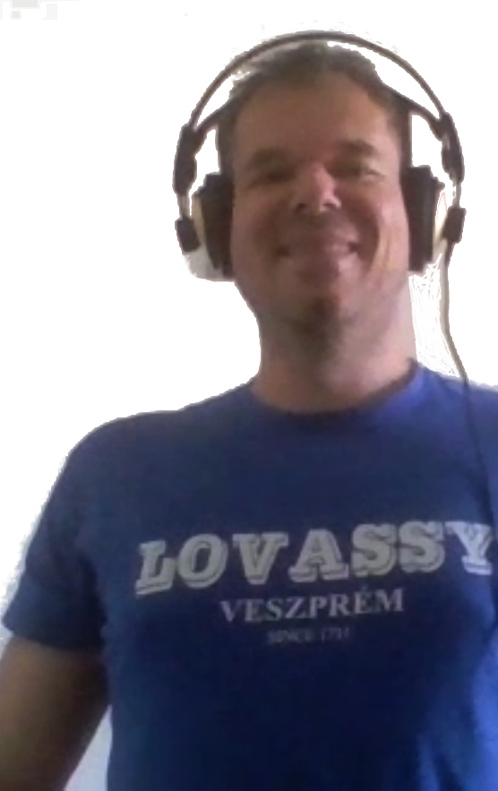
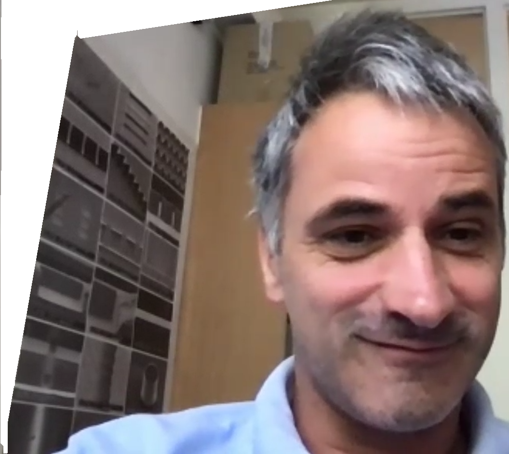
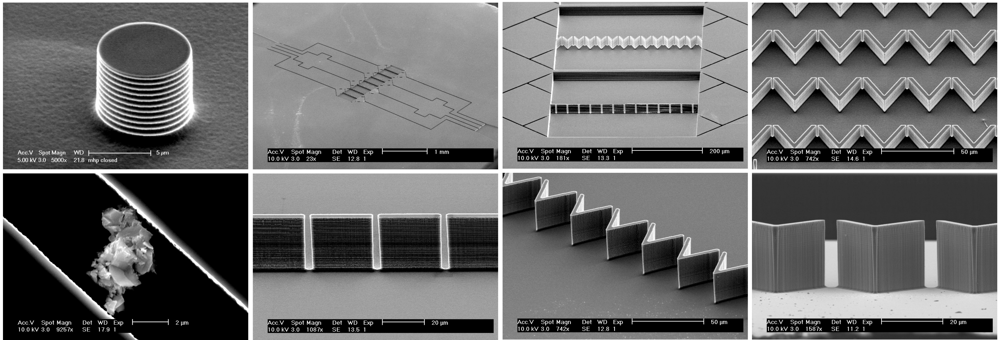
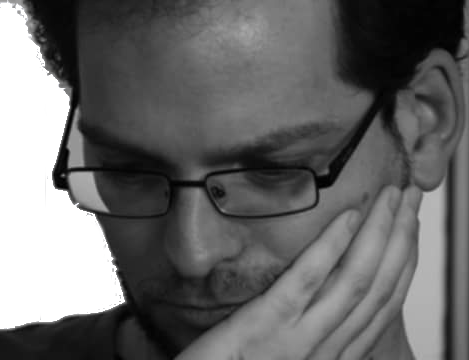

+++
title = 'Mi a Tudomány?'
type = 'articles'
date = 2022-09-10
author = 'Péter László riportösszeállítása'
description = '„Mi a tudomány?” – kérdezte DrMáriás a Tudósokból 1993­ban. A dalban elhangzó infantilisan eklektikus válaszok ma még aktuálisabban tükrözik az emberiség és a tudomány harmonikusnak éppen nem nevezhető viszonyát. Egyfelől mindinkább nélkülözhetetlenné váltak és válnak a tudomány eredményei, másfelől a tudomány elfogadásának a deriváltja erősen negatív. Nem lehet könnyű ma tudósnak lenni. Mi akkoriban épp csak elkezdtük az egyetemet, a tudományba épp hogy csak belekóstoltunk, de vannak, akik azóta maguk is tudósok lettek. A P&T három tudóssal, egykori osztálytársakkal beszélgetett.'
image = 'cover.jpg'
weight = 40
+++

[„Mi a tudomány?”](https://www.youtube.com/watch?v=A0Qo_27OmfA) – kérdezte DrMáriás a Tudósokból 1993­ban. A dalban elhangzó infantilisan eklektikus válaszok ma még aktuálisabban tükrözik az emberiség és a tudomány harmonikusnak éppen nem nevezhető viszonyát. Egyfelől mindinkább nélkülözhetetlenné váltak és válnak a tudomány eredményei, másfelől a tudomány elfogadásának a deriváltja erősen negatív. Nem lehet könnyű ma tudósnak lenni.

Mi akkoriban épp csak elkezdtük az egyetemet, a tudományba épp hogy csak belekóstoltunk, de vannak, akik azóta maguk is tudósok lettek. A P&T három tudóssal, egykori osztálytársakkal beszélgetett.

**Dr. Miklós István** a Rényi Alfréd Matematikai Kutatóintézet tudományos főmunkatársa. Számítástudománnyal foglalkozik, leszámlálások, mintavételezések számítástudományával. Történelmi okokból a sztochasztika osztályon van, az enumeratív kombinatorikához érzi magát közel. Amikor zoomon beszélgettünk, büszkén viselte a lovassys pólóját, amire a Középiskolai MTA Alumni Program révén tett szert.

Pista meghívott előadó volt, amikor tavaly októberben az MTA elnöke a Lovassyban indította útjára az új programot. Lát jövőt az alumni programban, és vannak ötletei, hogy hogyan lehetne a fiatalok érdeklődését felkelteni: „Jó lenne már középiskolában csepegtetni a diákokba, hogy mennyi mindent nem tudunk.” Persze mindenki hallott a matematika néhány híres megválaszolatlan kérdéséről, de úgy látja, nem ezek a megfelelő kérdések, ezek inkább elveszik a kedvet az egésztől. „Ezek olyan kérdések, amik irgalmatlanul nehezek. Nincs esélye egy diáknak, sőt egy felnőtt kutatónak sem. Olyan egyszerű feladatok kellenek, amiben egy középiskolás is tud eredményt elérni, főleg diszkrét matematikában vannak ilyenek."

Pista az ELTÉ­n végzett. Bioinformatikusként kezdett, aztán átcsábították az ELTÉ­ről a Rényi Intézetbe. „Gépi tanulás, biológiai makromolekulák szerkezetpredikciója” – ennek az elméleti hátterével kezdett foglalkozni. Hosszú volt az útkeresés. „Szerettem volna a matematika és a biológia határterületén dolgozni, a klasszikus biomatematika nem volt annyira izgalmas, a diszkrét matematika irányába ment.” Mostanra elég nagy kutatói szabadságot élvez. „Azt csinálsz, amit akarsz, de legyen eredménye. Évi 2­ 3, a nemzetközi átlagon felüli jó minőségű cikk, a legrangosabb nemzetközi újságokban kell publikálni.”
Megtudtam, hogy nem volt könnyű eljutni idáig. A PhD után 11 évig egyik ösztöndíjról a másikra ugrált, utána lett határozatlan idejű szerződése.

Hálával gondol vissza a Lovassyra: „Schultz Zolinak nagyon meg kell köszönni, hogy az analízis a kisujjamban van, amit állandóan használok.”

**Mi a tudomány?**

**István:** „A tudomány az, amikor ilyen kivonós játékból (Althöfer, Ingo; Bültermann, Jörg: Superlinear period lengths in some subtraction games. Theoretical Computer Science, 1995) ilyen fraktálvideót csinálsz.”

**Dr. Galajda Péter** Szegeden végzett fizikusként, most a Szegedi Biológiai Kutatóközpont tudományos főmunkatársa. Nagyon régóta nem találkoztunk, én csak arra emlékeztem, hogy a Bolognai Egyetemen csinált valamit valami optikai csipeszekkel.

„Majdnem, ez egy ilyen nem osztogatnak, hanem fosztogatnak…” Na tessék, öregszem! „Az Olaszország része az igaz, voltam másfél évig, de ez az egyetem végén volt ilyen diákcsere programban.” Ja, és Palermo, nem Bologna! „Palermóban fehérjék nagyon alacsony hőmérsékletű spektroszkópiájával foglalkoztam. Folyékony héliummal hűtöttük pár kelvinre a fehérjéket, és akkor néztük, hogy mozognak a különböző részei a molekuláknak. Amikor hazajöttem Szegedre PhD­zni, akkor kezdtem ezzel az optikai csipeszes dologgal foglalkozni, és ebből írtam a doktorimat. A PhD után mentem ki Amerikába (Princeton, Harvard), és eléggé más dolgokkal kezdtem foglalkozni. Baktériumokkal, mikrostruktúrák építésével, abba belerakjuk a baktériumokat. És ez a téma azóta megmaradt.” Amerika után két évig Hollandiában, a Delfti Egyetemen volt, 2010­ben jött vissza Szegedre.

A háta mögött egy nagyon érdekes posztert pillantottam meg, mikroszkópos képek a mikrostruktúrákról. „Ilyen mesterséges kis élőhelyeket csinálunk nekik, és abba belerakjuk a bacikat, és nézzük, hogy mit csinálnak. Nézzük, hogy ha hozzáadunk ezt, azt, amazt, tápanyagot, antibiotikumot, ilyesmit, akkor mit csinálnak ezekben a kis élőhelyekben. Hova húzódnak, hova próbálnak elszökni, hogy mozognak, hogy szaporodnak, hogyan kommunikálnak egymással.” Tetszik, hogy ilyen egyszerűen el tudja magyarázni egy laikusnak. „A baktériumok olyan egyszerű élőlények, hogy ezeket még egy fizikus is tudja tenyészteni, ellentétben emberi sejtvonalakkal, patkányokkal, amik sokkal érzékenyebbek.”

Ha már szóba kerültek az élőlények: „Gimnáziumban abszolút nem kötött le a biológia, de utólag visszanézve rengeteg dolgot tanultunk elvileg.” Na de hogyan készülnek ezek a mikrostruktúrák, egyáltalán, miből vannak? „Ami itt a poszteren volt, az szilícium. Hasonló módszerekkel készülnek, mint ahogy a csipeket gyártják. Nem annyira egyszerű, hogy bárki a saját laborjában meg tudja csinálni. Drága gépek kellenek. Azóta áttértünk egy sokkal egyszerűbb módszerre. Szilikongumiból csináljuk. Fényérzékeny gyantából öntőformát készítünk, folyékony szilikongumival kiöntjük.

A szilikongumin átmegy az oxigén, üveglappal irreverzibilisen lezárható.” Persze azért ez sem annyira egyszerű.  100 milliós készülékkel csinálják az optikai részét, pormentes laborban. A bal alsó képen egy porszem látható egy mikrostruktúrában.

**Mi a tudomány?**

**Péter:** „Az ember próbálja a világot megismerni valamilyen racionális eszközökkel, racionális keretrendszerben.”

**Golden Dániel PhD**t nehéz volt rábeszélni az interjúra, de szerzőnk kitartó nyaggatása végül sikerrel járt. Dani a Bölcsészettudományi Kutatóközpont Filozófiai Intézetének tudományos munkatársa, és az intézeti tudományos titkár szerepkörét is ő tölti be jelenleg. Kutatási területei a digitális kultúra, a pragmatizmus és a tudományfilozófia – már előre érzem, hogy végre meg fogjuk tudni, mi a tudomány!

A „filozófus” szó hallatán egy réveteg tekintetű, őszülő, pocakos­szakállas férfi ötlik fel. Miben más egy mai filozófus? „Ezek alighanem mind fontos attribútumai egy filozófusnak, mire eljut odáig, hogy valóban filozófusnak nevezheti magát. A tudományos életpálya 20–21. századi modellje ugyanakkor nem kedvez a bölcsesség beérésének: már huszonévesen publikálni és doktorálni kell, kutatócsoportok munkájában kell részt venni, pályázatokat kell beadni – mindezeknek az elvárásoknak egy mai fiatal filozófus is igyekszik megfelelni, még ha mindezek tökéletesen idegenek is a tárgy valódi természetétől.”

De milyen volt bimbózó bölcsészként egy specmatos osztályba járni? „A mi osztályunk minden szempontból inspiráló volt. A legfontosabbak azok az impulzusok voltak, amik az olyan eredeti gondolkodásmódok közös felfedezése kapcsán értek, mint amilyen például a Tudósok munkássága is volt.”

**Mi a tudomány?**

**Dániel:** „Minden látszat ellenére DrMáriásék kiváló választ adtak: még a leginkább csak gegnek vagy paródiának tűnő megszólalások mögé is többnyire oda lehet állítani egy bizonyos tudományfilozófiai elméletet vagy megközelítést. Az egymás után sorjázó vélemények végtelenített sokasága együttesen jól reprezentálja az ezzel kapcsolatban a laikusok és a hivatásos tudósok fejében egyaránt létező tematikus és stiláris sokféleséget. De ha ki kell emelnem, akkor a hozzám leginkább közel álló két vélemény Igoré, aki szerint 'a tudomány művészet', és Kornélé, aki szerint 'a lényeggel foglalkozik, és a kíváncsiságot jelenti'. A tudományos megismerés drámáját pedig érzésem szerint a maga teljességében egy másik klasszikus adja leginkább vissza: az Érdeklődő fiatalember.”
