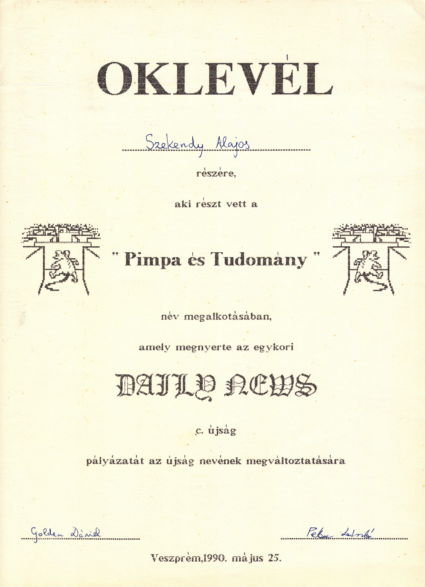

+++
title = 'Miért éppen _Pimpa és Tudomány_?'
type = 'articles'
date = 2022-09-10
kicker = 'Névadásunk titkos története'
author = 'Szekendy Alajos'
description = ''
image = 'cover.png'
weight = 170
+++

{.align-right}

Újságunk neve 1990-ben nyilvános pályázatot követően született meg. A végleges név kitalálása csapatmunka volt, melyben az itt látható oklevél tanúsága szerint jómagam is részt vettem. A történet háttere azonban sokkal érdekesebb, mint elsőre hinnénk.

Az „és Tudomány” egyértelmű utalás az Élet és Tudományra, amelyet még Szent-Györgyi Albert alapított
1946-ban, és a legnépszerűbb hazai tudományos ismeretterjesztő lap volt akkoriban. Érdekesség, hogy jelenlegi főszerkesztője, Gózon Ákos szintén lovassys diák volt.

„Pimpa” egy olasz rajzfilmsorozat, ami a ‘80-as évek közepén esti meseként ment a TV-ben. A címadó főszereplő egy hosszú fülű, lógó nyelvű piros pöttyös kutya, aki gazdájával, a bölcs Armandóval lakik egy házban. Pimpa nagyon kíváncsi, különféle kalandokba keveredik, sokszor segít bajba jutott állatokon, szomjazó növényeken vagy akár viharba került hajón, gyakran utazik különféle járműveken, mint pl. repülő vagy bicikli, amin tekerve a pöttyei kissé lemaradva követik csak őt.

A figurát 1975-ben találta ki egy neves olasz karikaturista, és a legnagyobb olasz napilap, a Corriere della Sera gyerekeknek szóló mellékletében jelent meg comic strip-ként, vagyis rövid, pár képből álló képregényként. Hamar sikeres lett, és már 1982-ben rajzfilmsorozat készült belőle. A 26 részből néhány fellelhető a YouTube-on, de nem öregedett szépen. Pimpa magyar hangja Paudits Béla volt, ami évtizedes félreértést okozott, mert Pimpa valójában lány.

Később további három sorozatban folytatták a kalandokat, de ezek már inkább egyszerű flash animációnak tűnnek. Ezeket is leadta a TV idehaza, de már mindennemű visszhang nélkül. Ugyan Pimpa végre női hangot kapott, de a történetek még egyszerűbbek és kiszámíthatóbbak lettek, így nosztalgiázni mindenképpen az első sorozat ajánlott.

A figura a mai napig népszerű Olaszországban, rendszeresen megjelenik lapokban, DVD-n, kiadtak róla bélyeget (ld. a 4. oldalon), és remek weboldala van (www.pimpa.it), ahonnét a Facebook és Instagram oldalát is elérhetjük.
Minderről mi semmit nem tudtunk 1990-ben, a nyugati képregények közül szinte kizárólag a francia Vaillant magazin történetei jelentek meg nálunk (pl. Pif és Herkules, Rahan, Dr. Justice) azon egyszerű okból, hogy a Vaillant-t a Francia Kommunista Párt ifjúsági lapjaként tartották számon. Rendszeresen olvastam a Pif és Herkulest a Kockásban, de egyszer sem sikerült rejtett marxizmus-leninizmust fülön csípni, ahogy a Pimpában sem volt ideológiai töltet. Mégis a forrás baloldalisága miatt a Vaillant képregényei a fiatalság számára megfelelőnek találtattak, míg a jobboldali-liberális Corriere della Sera gyerekmellékletének erre esélye sem volt. 

De honnan jött az ötlet az újság nevére a kétségkívül frappáns hangzáson túl? Ehhez vissza kell mennünk egészen a csopaki általános iskola néptánccsoportjának 1987-es finnországi fellépéséig. Galajda Péter barátunk is tagja volt a turnénak, és a sok színes élmény egyike volt, miszerint a helyi szlengben a ‘pimpa’ női nemi szervet jelent. Kerestem ehhez megerősítést, de mindenhol csak az angol ‘pimp up’ — felpimpel, tuningol — finn megfelelőjeként jelölték. Végül hosszas kutatás után meglett a megoldás (https://sv.wiktionary.org/wiki/pimpa): 
pimpa: (vardagligt, finlandssvenska) neutral benämning på det kvinnliga könsorganet
A fordítást bekapcsolva: „semleges kifejezés a női nemi szervekre”. A lényeg a „finlandssvenska”, ami a Finnországban beszélt svéd nyelvet jelenti, tehát a szó — mint kiderült — svéd.

Ez a duplacsavar a névben: a vicces piros pöttyös kutya és a tudomány abszurd összekapcsolásán túl van számunkra egy plusz jelentésrétege, és még észrevétlenül kimondtunk egy trágár szót is, mint a a klasszikus viccben annak idején Arisztid: „Milyen édesség van a tálcán? Tán nem kuglóf-asz ott?”

