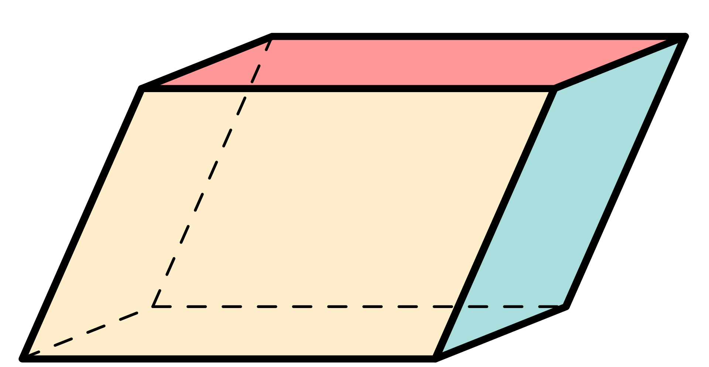
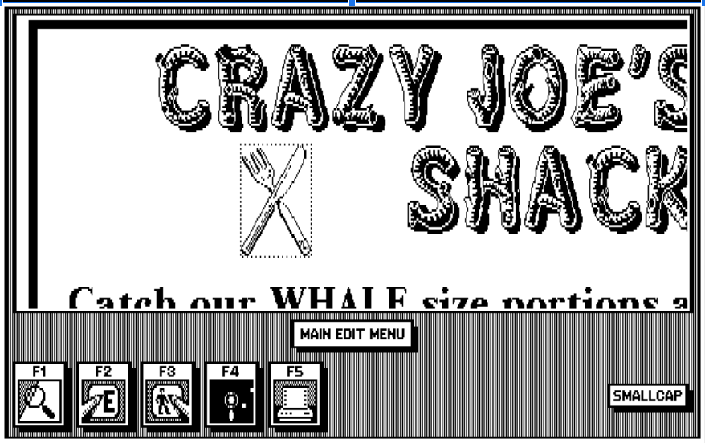
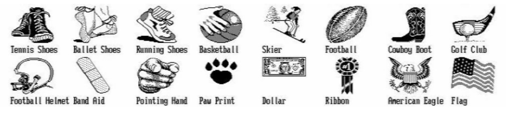
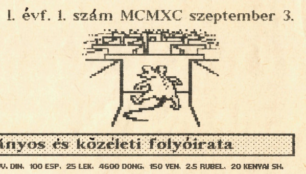
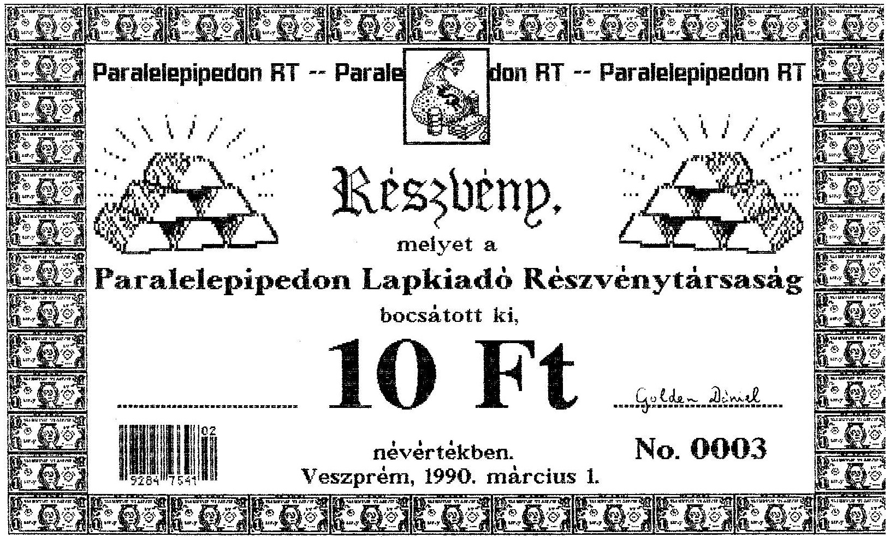

+++
title = 'Független elemzői értékelés a Paralelepipedon Lapkiadó Zrt. harminc éves működéséről'
type = 'articles'
date = 2022-09-10
author = 'Szekendy Alajos'
description = 'A méltán közkedvelt Pimpa és Tudomány mellett jóval kevesebben ismerik a Paralelepipedon Zrt-t. Ám míg a Pimpa és Tudomány sikere és népszerűsége megkérdőjelezhetetlen, a Paralelepipedon megítélése sokkal vegyesebb. Kezdettől fogva szeretett a háttérben maradni, és az sem javított a megítélésén, hogy fennállása során egyszer sem tett közzé részvényesi beszámolót, nem osztott meg semmit a terveiből, eredményeiből, nem hívta fel a részvényesek figyelmét az esetleges kockázatokra. A Pimpa és Tudomány jubileumi számában végre közzétesszük a kisrészvényesi nyomásra elkészült független elemzői beszámolót.'
image = 'cover.jpg'
weight = 90
+++

_A méltán közkedvelt Pimpa és Tudomány mellett jóval kevesebben ismerik a Paralelepipedon Zrt-t. Ám míg a Pimpa és Tudomány sikere és népszerűsége megkérdőjelezhetetlen, a Paralelepipedon megítélése sokkal vegyesebb. Kezdettől fogva szeretett a háttérben maradni, és az sem javított a megítélésén, hogy fennállása során egyszer sem tett közzé részvényesi beszámolót, nem osztott meg semmit a terveiből, eredményeiből, nem hívta fel a részvényesek figyelmét az esetleges kockázatokra. A Pimpa és Tudomány jubileumi számában végre közzétesszük a kisrészvényesi nyomásra elkészült független elemzői beszámolót._


**Paralelepipedon:**

A paralelepipedon olyan hat lap által határolt térbeli geometriai alakzat, amelynek minden oldallapja paralelogramma. A név a görög παραλληλ-επίπεδον (párhuzamos síkok) kifejezésből ered. _(forrás: Wikipédia)_



A Paralelepipedon Zrt. (akkor még Rt.) 1990-ben alakult, a részvénykibocsátás 1990. március 1-jén történt. Hogy időben elhelyezhessük mindezt: Horn Gyula a Németh-kormány külügyminisztereként Moszkvában tárgyal Eduard Sevardnadzéval a szovjet csapatok kivonásáról, az első szabad parlamenti választás pedig csak pár héttel később, március 25-én történt. Történelmi idők voltak, minden hétre jutott legalább egy, korábban elképzelhetetlennek tartott esemény, a szocialista világrendszer pár hónap alatt darabjaira hullott. Ezen történelmi események farvizén, mintegy árnyékában próbáltak meg a Paralelepipedon magukat rendkívül dörzsöltnek gondoló alapítói  gyorsan és nagyot akasztani.

Mentségükre felhozható, hogy a kor számos más szerencselovagjával ellentétben nem a becsődölt állami vállalatok hulláin sakálkodva próbáltak instant vagyont harácsolni, hanem a tőkefelhalmozás sokkal rögösebb, bár tulajdonképpen eredeti útját választották: vállalatot alapítottak, és megpróbálták saját terméküket a szabad piacon tisztes haszonnal értékesíteni. Ám ha közelebbről megnézzük a történetüket, nyilvánvalóvá válik, hogy mindössze a legsötétebb manchesteri kapitalizmus (vö. Friedrich Engels: A munkásosztály helyzete Angliában) receptjét próbálták meg a rendszerváltás környéki zavaros időkben alkalmazni, mint azóta kiderült: sikertelenül.


**A munkásosztály helyzete Angliában:**

Friedrich Engels 1842–1844 közötti angliai tartózkodása alatt szerzett tapasztalatai alapján írta meg a korabeli munkásosztály sanyarú helyzetét bemutató híres könyvét. Lenin méltatása szerint: _„Ez a könyv borzalmas vádirat volt a kapitalizmus és a burzsoázia ellen. 
(…) És valóban, sem 1845 előtt, sem később nem jelent meg a munkásosztály nyomorának egyetlen ilyen élethű és pontos ábrázolása sem.”_


Az ötlet megvolt, de mi volt a termék? Egy addig mindössze 4 számot megért, mérsékelt sikerű középiskolai lap, a _Daily News_ a veszprémi Lovassy László Gimnázium II.A matek tagozatos osztályától. A szerzőgárda néhány lelkes gimnazista, akik kíváncsian próbálgatták az akkori kezdetleges asztali kiadványszerkesztő megoldásokat, nyitottak voltak a világra, humorosak voltak, és szinte minden érdekelte őket az irodalomtól a bakonyi túrázásig. Mai fogalmaink szerint a lap egy ígéretes startup volt, de a dúsgazdag, pénzt helikopterről szóró kockázati befektető és a kaliforniai álom helyett nekik csak a Paralelepipedon Rt. jutott. A konstrukció szerint a részvénytársaság átvette a kiadói feladatokat, intézte a terjesztést, szervezte a hirdetőket, és nagy újításként az újságot immár pénzért adta, míg a szerzők újságírói igazolványt kaptak,  és tiszteletdíjat kaphattak a cikkeikért, illetve kezdetleges előfizetői konstrukciót is kínáltak az olvasóknak. Röviden: piaci alapokra próbálták helyezni a lap működését.


Az eredeti Daily News mind a négy száma klasszikus, fél asztalnyi IBM PC XT-n készült NewsMaster 1.0 programmal, a nyomtatás pedig Epson FX-100+ mátrixnyomtatóval történt. Ez már tudott sima A4-es lapra is nyomtatni, nem csak perforált szélű leporelló papírra. Minden példány laponkénti egyedi nyomtatással készült, ráadásul az ékezeteket a NewsMaster nem kezelte, így ezeket kézzel-tollal kellett utólag pótolni. És hogy emlékszik a hálátlan utókor az akkor csodaszámba menő NewsMasterre?

_„NewsMaster, from Unison World, is a primitive low-cost desktop publishing program aimed at home users and low end PCs. It supports both dot-matrix and laser printers.”
([forrás](https://winworldpc.com/product/newsmaster/15))_



Az induló tőkét elsődleges zártkörű részvénykibocsátással kívánták bevonni a piacról, az operatív működést pedig a folyamatos lapértékesítésekből finanszírozni. A tőzsdei bevezetés ötlete – szerencsére – nem merülhetett föl, mivel a Budapesti Értéktőzsde csak 1990 júliusában nyílt meg újra. Az egész sokkal inkább hasonlított egy analóg kézműves Kickstarter-kampányra, mintsem egy professzionális részvénykibocsátásra.

{.align-right}

A nyomdából 1990. március 1-jei dátummal kikerülő értékpapírok ugyanazzal a technikával készültek, mint az újság, csak antik hatású, sárgásabb papírra. Érdemes itt egy pillanatra elidőzni a grafikai megvalósításnál. Az egészről süt a talmi gőg, a hübrisz és a nagyravágyás: csillogó aranyrudak, súlyos pénzeszsákok, dollárbankók keretjelleggel. Szokatlan visszafogottságot mutat, hogy az 1 dolláros bankjegyet tették rá, de ennek prózai oka van: csak ez volt a _clipart_ készletben. Ám ezt a hiányosságot remekül kompenzálták a bankó ornamentikus megsokszorozásával.

A sorszámnak már az első kibocsátáskor 9999-ig volt hely, nem kispályában gondolkodtak a srácok Veszprémben. Csak becsléseink vannak, hány részvény került kibocsátásra, de biztos, hogy az elméleti 9999 darabnak csak a töredéke. Jó felső becslés lehet, hogy első körben a 35 fős osztály körében tervezték az értékesítést, fejenként max. 2 részvénnyel. Alsó becslésként használhatjuk, hogy 0006-nál magasabb sorszámú részvény nem került még elő. Mindent összevetve maximum 20 db-ra tehető az első körben kibocsátott részvények száma, amiből a bevétel legjobb esetben 200 Ft volt, de elképzelhető, hogy a menedzsment önmagát is javadalmazta néhány papírral, így még kevesebb a befolyt összeg.

{.align-right}

A sikeres kibocsátást követően a menedzsment nagy médiafelhajtással megtámogatott pályázatot írt ki az újság nevének megváltoztatására, melynek sikeres levezénylése után a lap felvette az azóta legendássá vált Pimpa és Tudomány nevet, mely néven 1990 szeptemberében jelent meg az első szám. Ekkor szerepelt először az azóta szintén ikonikussá vált _mouse in maze_ logó is.

A lap induló ára 8 Ft volt, ami a korabeli újságárakhoz képest drágának számított. Összehasonlításképpen a napi 16 oldalon megjelenő Népszabadság ekkor 6,50 Ft-be került, a _Napló_ 4,30 Ft, míg a népszerű színes hetilap, a _Nők Lapja_ 13,50 Ft volt. Nehéz a pontos összevetés, mert 1990–91-ben volt a forint – eddigi – legmagasabb inflációja: évi 29%, majd 35%, ám bizonyos termékköröknél ez 50-80% is lehetett (emlékezzünk: taxisblokád, illetve lapunk megjelenésekor talán már csak az „első taxisblokád”...), így az árak egy éven belül is nagymértékben emelkedhettek. A 8 Ft ma kb. 150 Ft-nak felel meg.

A forint mellett a lap több külföldi pénznemben is megvásárolható volt. Ezek közül a német márka, az osztrák schilling, az olasz líra, a spanyol peseta, a jugoszláv dínár, a szovjet rubel már nem léteznek, a P&T ezeket mind bravúrosan túlélte. A mongul tugrik, az albán lek,
a vietnami dong, a kenyai shilling – bár igen komoly inflációtól sújtva – ma is forgalomban vannak. Egyértelmű, hogy ezekkel szemben is hosszú távon érdemesebb volt/lett volna P&T-t vásárolni. Az amerikai dollár és a japán jen viszont folyamatosan kirobbanó formában van, aki ezekből fizette a lapot, az bizony akár Quaestor-kötvényt is vehetett volna.

A kuvaiti dinár gyanús, nagyon gyanús. Itt ismét felsejlik a Paralelepipedont folyamatosan körüllengő iraki-kuvaiti-Szaddám Huszein-szál. Emlékeztetőül: Irak 1990. augusztus 2-án, alig egy hónappal a P&T megjelenése előtt szállta meg Kuvaitot. A lap második oldalán ott a cáfolatnak álcázott, ám tulajdonképpen nyílt beismerés: „Szaddám Husszein támogatja a Paralelepipedon Rt.-t ?!?” Majd a következő számban egész oldalas iraki tudósítás Szaddám Huszein arcképével... A kuvaiti dinár azóta is létezik, túlélt minden háborút.

Érdekességképpen a korabeli P&T árakat mai árfolyamon forintosítva a két szélsőérték: 285 mongol tugrik ma csak 35 forintot ér, 150 japán jen pedig több mint 430 forintot. Vajon ez véletlen lenne? Aligha. Mindkét nép távoli rokonunk.

A P&T 1992-es második száma több mint másfél évvel az első, kirobbanóan sikeres szám után jelent csak meg. Mi történt ez idő alatt? Lenyúlták a részvényesek pénzét, és távoztak Belize-re? A legoptimistább becslések szerint is a befolyt összeg maximum 20
részvény (20 x 10 Ft = 200 Ft) és 25 eladott újság (25 x 8 Ft = 200 Ft) ellenértéke lehetett, vagyis 400 Ft. Ez még a Cimbora sörkertben is csak 8 korsó sört ért akkoriban (ld. P&T, 1992. májusi szám, 10. oldal).

Ez a búcsúszám mind terjedelemben, mind színvonalban, mind megjelenésben messze a korábbi számok fölé emelkedett. Ez már Ventura Publisher programmal és HP lézernyomtató + fénymásoló vegyes technikával készült, ami lehetőséget adott egyedi képek kezdetleges beillesztésére. Az ára is 25 Ft-ra nőtt, de a korabeli vágtató infláció, a többszörös terjedelem és a magas előállítási költségek miatt ez indokolt is volt.

A választható fizető valuták közé bekerült a jemeni rial, ami egyértelműen annak tudható be, hogy Észak-Jemen jó hely. Az etióp birr viszont – elég nehezen megfejthető, de sikerült neki a bravúr – lelökte a mongol tugrikot a leghitványabb valuta dobogójáról: 2,5 birr mai árfolyamon mindössze 18,50 Ft-ot ér.

Az utolsó szám sikere elsöprő volt, de sajnos már későn jött. Ugyan benne volt a levegőben a folytatás, készültek is írások, de a szerkesztőség szétszéledt, mindenki mással kezdett foglalkozni. De most, harminc év múltán végre eljött az idő: elkészült a legújabb szám minden korábbinál nagyobb terjedelemben és magasabb színvonalon – a részvények kilőhetnek.

Erre való tekintettel független elemzői véleményem a menedzsment jelen lapszámban közzétett ajánlatára (ld. a 19. oldalon): a részvényt vételre javaslom azoknak, akiknek nincs, és tartásra, akiknek van. Ha valaki sajátos egyedi élethelyzete miatt mégis kénytelen megválni a papírtól, javaslom, próbálja meg sör helyett inkább japán jenben bonyolítani az ügyletet (587 Ft részvényenként), és mindenképpen utasítsa el az etióp birrben való elszámolást (7,40 Ft/részvény).

## Szakértői vélemények

**Bróker Mária, pénzügyi tanácsadó**

A kilencvenes évek első felében minden komoly ügyfelemnek azt javasoltam, hogy kizárólag Paralelepipedonba fektessen. Aki jókor fogadta meg a jó tanácsot, ma már egy exkluzív tengerparton süttetheti a hasát.

**Kis Péter, a Buda­Cash Brókerház Zrt. vezető elemzője**

Azt gondolom, hogy egy igazán kiegyensúlyozott portfóliónak ma is nélkülözhetetlen elemét alkotják a Paralelepipedon részvények. Rövidtávon talán kevésbé tűnik vonzónak, de hosszútávon mindenképpen megszolgálja a bizalmat.

**Nagy Pál, a QUAESTOR Értékpapír­kereskedelmi és Befektetési Zrt. vezető elemzője**

Az utóbbi évek csalódást keltő bluechipjei közül kiragyogott a Paralelepipedon gyöngyszeme, amely a legnehezebb időkben is tudott meglepetést okozni. Csak a legbátrabbak mertek rá fogadni, de nekik nagyon megérte.

{.align-right}

**K-né, kisbefektető**
Mi itt Debrecenben tiszta szívből és mélyen bíztunk benne, hogy az olyan magyar
papírokba vetett töretlen hitünk, mint amilyen a Paralelepipedon, végül minden
becsületes magyar ember számára elhozza a feltámadást. És akkor majd természetesen
tudni fogjuk, kinek tartozunk ezért is hálával! (A fiam néha elfelejti a
vagyonnyilatkozatába beírni, de hát az vesse rá az első követ, aki nem szokott ilyen
apróságokban tévedni.)

**Tóth Antal, bennfentes kereskedő**

Para­részvény? No para – aki okos, egy életre elteszi!
