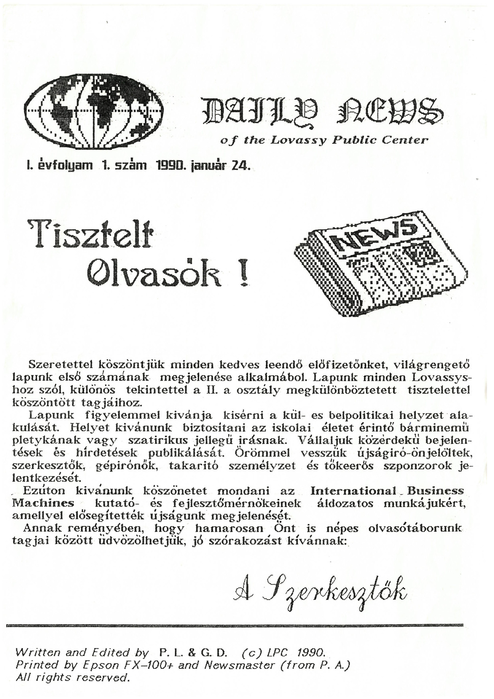

+++
title = 'A _Pimpa és Tudomány_ sajtó-, média- és kultúrtörténeti jelentősége'
type = 'articles'
date = 2022-09-10
author = 'Golden Dániel'
description = 'A magyar sajtó- és médiatörténet bővelkedik olyan példákban, amikor egy adott produktum jelentősége nem a hivatalosan igazolt példányszám, nem a nyilvánosság hatalmi hierarchiájában elfoglalt pozíció, nem a hirdetői szempontból releváns társadalmi csoportok százalékos elérése alapján ítélhető meg, hanem a tág értelemben vett kulturális szerep figyelembe vételével. Jelen tanulmány egy olyan úttörő kezdeményezésre hivatott ráirányítani a reflektorfényt, amelyről mind a mai napig fájóan kevesen és fájóan keveset tudnak. Megtéve ezzel az első lépést annak érdekében, hogy a magyar művelődés történetében az őt megillető magas polcra kerülhessen Kármán József Urániája, Németh László Tanuja, az ellenzéki szamizdatok és az underground fanzinok legkiemelkedőbbjei mellé.'
image = 'cover.jpg'
weight = 50
+++

{.align-right}

A magyar sajtó- és médiatörténet bővelkedik olyan példákban, amikor egy adott produktum jelentősége nem a hivatalosan igazolt példányszám, nem a nyilvánosság hatalmi hierarchiájában elfoglalt pozíció, nem a hirdetői szempontból releváns társadalmi csoportok százalékos elérése alapján ítélhető meg, hanem a tág értelemben vett kulturális szerep figyelembe vételével.

Jelen tanulmány egy olyan úttörő kezdeményezésre hivatott ráirányítani a reflektorfényt, amelyről mind a mai napig fájóan kevesen és fájóan keveset tudnak. Megtéve ezzel az első lépést annak érdekében, hogy a magyar művelődés történetében az őt megillető magas polcra kerülhessen Kármán József _Urániája_, Németh László _Tanuja_, az ellenzéki szamizdatok és az underground fanzinok legkiemelkedőbbjei mellé.

A kezdetben _Daily News_ címen ismertté vált lap megjelenését a legnagyobb jóindulat mellett is hektikusnak kell minősítenünk: az első négy szám (1990. január 24., február 2., 19. és 27.) egy bő hónap leforgása alatt, dinamikusan növekvő terjedelemben került az olvasók elé. Valószínűsíthető, hogy éppen a lap népszerűségével egyenes arányban, azaz szinte exponenciálisan növekvő tartalom mennyisége merítette ki a háttérben dolgozó munkatársak erőtartalékait, ezért állt be ezután hosszabb szünet a megjelenésben. A kihagyást ugyanakkor a jövőbe való befektetésként kell értékelnünk, amennyiben a látnivalóan tudatos építkezés jegyében a kieső hónapokat a technikai eljárások korszerűsítésére és a szerkesztőség megszilárdítására használták fel.

Így jelenhetett meg immár új néven, új évfolyamszámozással, ám minden tekintetben jogfolytonosan a _Pimpa és Tudomány_ első száma 1990. szeptember 3-án. A névváltoztatás bízvást minősíthető szimbolikusnak: míg a korábbi, a nyugati importból származó tördelőprogram által automatikusan felkínált név magában hordozta a közép-európai kishitűséget és amerikamajmolást, ezzel szemben az új név a nemzetközi kitekintéssel bíró, ám gyökereiben hamisítatlan magyar szellem eredeti pezsgéséről tanúskodott.^1^

A két dátum közé eső időszakban Magyarországon lezajlott a rendszerváltás – ám ennek nehézségei történelmi perspektívából nézve eltörpülni látszanak a lap újraindításáért és életben tartásáért folytatott heroikus küzdelem mellett. Máig bizonyítatlan, de a történések közelsége okán ki sem zárható, hogy a további számok megjelenését a taxisblokád néven elhíresült események blokkolták. Mindenesetre a következő időszak kibontakozó magyarországi vadkapitalizmusának egyre élesedő piaci versenyében már csak egy alkalommal sikerült a lapnak főnixmadárként hamvaiból feltámadnia: 1992. május 5-én egy összevont 1–3. számmal jelentkezett minden korábbit messze meghaladó, 10 oldalas terjedelemben. Mivel azonban ez történetesen az érettségi év utolsó iskolai hetére esett, az örömteli kiteljesedés egyúttal a szomorú véget is jelentette, ahogy azt a főszerkesztői beköszönő címe is jelezte: „Búcsúzunk”.^2^

A mindezidáig utolsó lapszám impresszumát^3^ böngészve a kutató megvilágító erejű információk birtokába juthat. Egyrészt kiderül, hogy a „Lovassy Gimnázium IV.A osztályának” lapjáról van szó, aminek jelentősége a rendszerváltás körüli években nem lebecsülendő. Gondoljunk csak azokra a nagy horderejű változásokra, ahogyan a napilapoknak, irodalmi folyóiratoknak többé már nem a cenzurális felügyeletet is egy füst alatt ellátó megyei pártbizottságok lettek a kiadói. Látható, hogy a szamizdat lehetőségeit kihasználva a P&T-nek is sikerült rést találnia a pajzson, így válhatott az újkeletű szólás- és sajtószabadság példaértékű megtestesítőjévé. Ennek megfelelően a lap olvasói mindenféle korlátozás nélkül számíthattak az önmeghatározás szerint „tudományos, kuturális és közéleti” tartalmakra. A „tudomány” és a „közélet” nem igényel további magyarázatot, a „kuturális” (_sic!_) különleges írásmódja ugyanakkor több mindenre is utalhat. Értelmezhető a Balaton-felvidéki tájszólás reprodukciójaként a helyi értékek (és persze a helyiértékek) iránti elköteleződés jelzésére, de felfogható a szerkesztőség sajátos viszonyának kifejeződéseként is a „kultúra” néven ismert jelenségkörhöz, nem utolsósorban a HG, KGZ, MT, CsL képviselte fősodratú intézményesült irányokkal szemben. Ezt támaszthatja alá, hogy a lap kétségtelenül mindvégig alapvető nyitottságot mutatott a rétegkulturális vagy egyenesen periférián lévő alkotók munkássága iránt Li Taj-pótól Tőzsér Árpádon át Waszlavik Lászlóig.^4^ A körülményekkel vívott sziszifuszi (pirruszi, lukulluszi, drákói, sztentori stb.) küzdelemnek állít emléket a „Megjelenik nagyon ritkán, kb. 25 példányban.” mondat, illetve a maga kegyetlen nyíltságával még ennyi idő elteltével is belénk hasító negáció: „Nem terjeszti a Magyar Posta.” Mindezek után nem meglepő, és bármilyen ezzel kapcsolatos szemrehányást okafogyottá tesz, hogy a szerkesztőség így nyilatkozik: „Kéziratot nem őrzünk meg, és nem küldünk vissza.” S valóban micsoda felelőtlenség lett volna ennek ellenkezőjét ígérni tekintettel arra, hogy a következő szám megjelenésére harminc évet kellett várni!^5^ Mint ahogy az is a szerkesztők körültekintését és mély humanizmusát dicséri, hogy nem mulasztottak el a következő, örökérvényű figyelmeztetéssel élni: „A lapot mindenki saját felelősségére olvashatja!”

Ami az újság tartalmát illeti, az egyértelműen elmondható, hogy minden ízében magán viseli a kor lenyomatát, tehát túlzás nélkül kordokumentumnak nevezhető. Szinte mindenről tudósít, ami azokban az években igazán számított itthon és külföldön egyaránt a Lovassy Diákszövetségnek a DEMISZ-ből (_sic!_) való kiválásától az iraki valóságon és a magyarországi Opel-gyártás elindulásán át a Tvinpíx (_sic!_) sikeréig.^6^ De sok tekintetben messze meg is előzte korát: a kenyai horoszkóp^7^ egy évtizeddel a dakota közmondások felfedezése előtt nyitott kaput az ősi népek bölcsességére, a szerkesztők pedig nagyon hamar rátaláltak és arcpirító magabiztossággal használták a soha be nem váltott ígéretek olvasó-, illetve szekértábor építő módszerét.^8^

Hasonlóképpen a forma tekintetében: az asztali kiadványszerkesztés hőskorából származó példaként tökéletesen nyomon követhető az egymást követő lapszámokon a technikai feltételek, az alkalmazott hardverek és szoftverek fejlődése egészen a magyar ékezethelyes betűtípusok Kánaánjának eljöveteléig. Nem kevésbé a gazdasági háttér megteremtését illetően – a szerkesztők az idők szavára hallgatva már rögtön a kezdetekkor „tőkeerős szponzorok” jelentkezését várták^9^, majd igyekeztek a korszellemnek megfelelően biztos alapokra helyezni a lap működését a hirdetési felületek megfelelő értékesítésével.^10^ Az új névvel együtt megkezdődött a megrendelők gyűjtése is, illetve megalakult a Paralelepipedon Lapkiadó Részvénytársaság, amely 1990. március 1-jei dátummal tette lehetővé a hazai és nemzetközi részvénypiacok szereplői számára, hogy tulajdonrészt szerezzenek a szépreményű médiaipari vállalkozásban, a menedzsment pedig igyekezett kihasználni a nemzetközi pénzpiacok mozgásában rejlő lehetőségeket.^11^

Mindezek látszólag megteremtették a feltételeit annak, hogy az újság valóban komoly szeletet harapjon ki a magyar médiapiaci tortából. Hogy erre végül is miért nem került sor, az a mai napig vita tárgya: a kutatók egy része a nemzetközi helyzet fokozódását okolja, más részük azt, hogy lejtett a pálya. Abban azonban elemzői konszenzus tapasztalható, hogy a lap továbbélése esetén egészen másképp alakultak volna a magyarországi médiaviszonyok, s a sajtószabadságra a következő évtizedekben mért súlyos csapások alighanem megelőzhetőek lettek volna.

^1^	Ld. a „Szeky” aláírású olvasói levelet, az arra adott szerkesztői választ, valamint a névpályázat meghirdetését, _Daily News_, 1990/3. szám,
	 [4]. o., továbbá Szekendy Alajos forrásértékű visszaemlékezését, _Pimpa és Tudomány_, 2022/1–7,2. szám, 22. o.\
^2^	Ld. _Pimpa és Tudomány_, 1992/1–3. szám, [1]. o.\
^3^	Ld. _Pimpa és Tudomány_, 1992/1–3. szám, 10. o.\
^4^ 	Ld. _Daily News_, 1990/4. szám, [2]. o., valamint _Pimpa és Tudomány_, 1992/1–3. szám, 4–6. o.\
^5^ 	Ld. az újonnan közölt korabeli Szekendy Alajos-kéziratokat, _Pimpa és Tudomány_, 2022/1–7,2. szám, 12–13. o.\
^6^	Ld. _Daily News_, 1990/3. szám, [1]. o., valamint _Pimpa és Tudomány_, 1992/1–3. szám, 2–3. és 8–9. o.\
^7^	Ld. _Daily News_, 1990/2. szám, [2]. o., 3. szám, [2]. o. és 4. szám, [2]. o.\
^8^	Ld. _Daily News_, 1990/1–4. szám, valamint _Pimpa és Tudomány_, 1990/1. szám és 1992/1–3. szám.\
^9^	Ld. _Daily News_, 1990/1. szám, [1]. o.\
^10^	Ld. _Daily News_, 1990/3. szám, [4]. o. és 1990/4. szám, [2]. o.\
^11^	Ld. _Pimpa és Tudomány_, 1990/1. szám, [2]. o.
