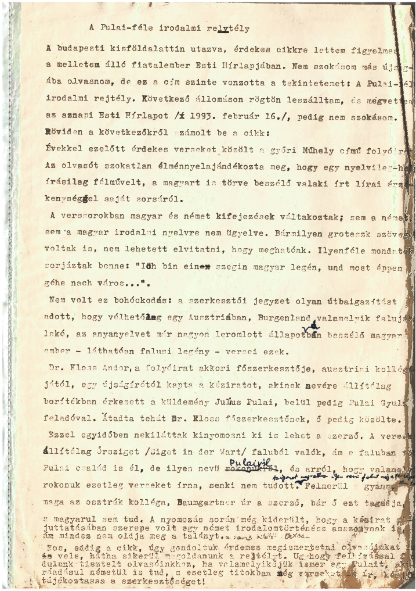

+++
title = 'A Pulai-féle irodalmi rejtély'
type = 'articles'
date = 2022-09-10
author = 'Szekendy Alajos'
description = 'Készült egy 1993-as eredeti gépirat alapján.'
image = 'cover.jpg'
weight = 60
+++

{.align-right}

A budapesti kisföldalattin utazva érdekes cikkre lettem figyelmes a mellettem álló fiatalember _Esti Hírlapjában_. Nem szokásom más újságjába beleolvasni, de ez a cím szinte vonzotta a tekintetemet: A Pulai-féle irodalmi rejtély. A következő állomáson rögtön leszálltam, és megvettem az aznapi _Esti Hírlapot_ (1993. február 16.), pedig nem szokásom.

Röviden a következőkről számolt be a cikk. Évekkel ezelőtt érdekes verseket közölt a győri Műhely című folyóirat. Az olvasót szokatlan élménnyel ajándékozta meg, hogy egy nyelvileg-helyesírásilag félművelt, a magyart is törve beszélő valaki írt lírai érzékenységgel a saját sorsáról. A verssorokban magyar és német kifejezések váltakoztak; sem a német, sem a magyar irodalmi nyelvre nem ügyelve. Bármilyen groteszk szövegek voltak is, nem lehetett elvitatni, hogy meghatóak. Ilyenféle mondatok sorjáztak benne: „Ich bin einen szegin magyar legén, und most éppen géhe nach város…”.

Nem volt ez bohóckodás: a szerkesztői jegyzet olyan útbaigazítást adott, hogy vélhetőleg egy Ausztriában, Burgenland valamelyik falujában lakó, az anyanyelvet már nagyon leromlott állapotában beszélő magyar ember – láthatóan falusi legény – versei ezek. Dr. Kloss Andor, a folyóirat akkori főszerkesztője ausztriai kollégájától, egy újságírótól kapta a kéziratot, akinek nevére állítólag borítékban érkezett a küldemény Julius Pulai, belül pedig Pulai Gyula feladóval. Átadta tehát Dr. Kloss főszerkesztőnek, ő pedig közölte.

Ezzel egyidőben nekiláttak kinyomozni, ki is lehet a szerző. A versek állítólag Őrsziget (Siget in der Wart) faluból valók, ám e faluban több Pulai család is él, de ilyen nevű Pulairól, és arról, hogy valamelyik rokonuk esetleg verseket írna, senki nem tudott.

Felmerül a gyanú, hogy maga az osztrák kolléga, Baumgartner úr a szerző, bár ő ezt tagadja, s magyarul sem tud. A nyomozás során még kiderült, hogy a kézirat eljuttatásában szerepe volt egy német irodalomtörténész asszonynak is, ám mindez nem oldja meg a talányt a szerző kilétét illetően.

Nos, eddig a cikk, úgy gondoltuk, érdemes megismertetni olvasóinkat vele, hátha sikerül megoldanunk a rejtélyt. A magam részéről ilyen nevű falut még a térképen sem találtam. _(A szerkesztő megjegyzése: manapság a google maps ezt megkönnyíti: [íme itt](https://www.google.com/maps/place/7501+Siget+in+der+Wart,+Austria/@47.2615508,16.2536383,14z/data=!3m1!4b1!4m5!3m4!1s0x476e931da7facffd:0xf97afd17556c9e3c!8m2!3d47.2613499!4d16.27859).)_ Úgyhogy felhívással fordulunk tisztelt olvasóinkhoz: ha valamelyikük ismer egy Pulait, aki ráadásul németül is tud, s esetleg titokban még verseket is ír, kérjük, tájékoztassa a szerkesztőséget!

