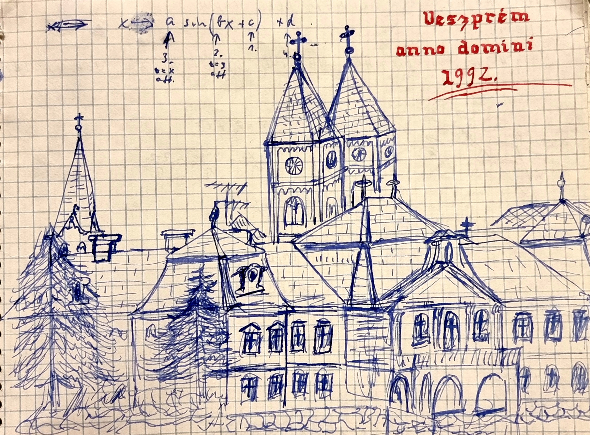

+++
title = 'Születésnapunkra'
type = 'articles'
date = 2022-09-10
author = 'Péter László'
kicker = 'Vezércikk'
description = '32 éves a Pimpa és Tudomány'
image = 'cover.jpg'
weight = 10
+++

*32* éves lett a Pimpa és Tudomány és, miként József Attila és mai követői (ld. 18. oldal), megleptük magunkat és lelkes olvasóinkat egy rendkívüli számmal.
32 évünk elszelelt, és be kell ismernünk, hogy a P&T nem tud felmutatni gazdasági sikereket (ld. 14-15. oldal), olvasótáborunk stagnál, a tőkeemelés a Paralelepipedon Rt-től (ld. 14. oldal) ma már a nyomtatási költségeket sem fedezi. A sörárakkal ellentétben bevételeink az inflációt sem követték, rezsicsökkentés és uniós finanszírozás ide vagy oda, svájci frankban vagy forintosítva, továbbra is csak rászorulunk az orosz földgázra és a kínai piacra.
Lehettünk volna az ország legnépszerűbb szórakoztató és tudományos magazinja, vagy a szabad sajtó utolsó fellegvára (ld. 10-11. oldal), de nem lettünk, mert harminc évvel ezelőtt Veszprém híres gimnáziuma tarisznyát tett a vállunkra benne csontra száradt pogácsával, és mi az évszázados hagyományokat követve elballagtunk. Nem csak elballagtunk, de szétszéledtünk – busszal, vonattal, repülővel (ld. térképünket a hátsó borítón.)
Lapunk hibernálódott, de nem szűnt meg. A korábban leközölt rejtvények megoldásai (ld. 9., 13. és 19. oldal), félkész cikkek (ld. 12-13. oldal) mappákban és dobozokban vártak, hogy aztán a megsárgult lapok újból életre keljenek, időutasként térjenek vissza, miként Walt Disney kriogenikusan fagyasztott teste, bár a hiedelmekkel szemben Walt Disney-t halála után elhamvasztották. Egy másik hiedelemmel ellentétben Pimpa nem Walt Disney műhelyéből került ki, hanem az olasz kreatív ipar gyermeke. Próbáltuk felvenni a kapcsolatot Pimpa alkotójával, de sajnos nem jártunk sikerrel. Talán a kiadó nem értett angolul. Talán meg kellett volna kérni egy másik olaszt, hogy tolmácsoljon.

Sok minden változott 32 év alatt. A technológia mindenképpen. Bár már akkor is számítógéppel szerkesztettük a lapot, a cikkeket ekezetek nelkul irtuk es nyomtatas utan kezzel huzkodtuk be oket minden egyes peldanyon! Igazán jó mulatság volt, ezúttal pedig olvasóink is kipróbálhatják a 11. oldalon. A másik változás, ami engem szíven ütött, hogy ma meg kell gondolnunk, hogy miről írhatunk, kitől mit kérdezhetünk. Mert hát nem tudjuk. kik jönnek, és mit kérdeznek majd. Nem tudjuk, ki mire jó, nem tudjuk, mi árthat nekik.
Ha örül Orbán Viktor úr... na de hagyjuk a politikát, hiszen nem siratóünnep ez, kár lenne pörlekedni, áskálódni azon, hogy ki ölt meg kit.
Haladtunk a korral. Bár megtartottuk a nyomtatott formátumot, lapunk előbb-utóbb megtalálható lesz a pimpaestudomany.hu címen is. Mivel a papírra nem lehet klikkelni, helyette a lap szélén elhelyezett QR-kódokat használunk. 
Az újság, amit olvasónk kezében tart (vagy a képernyőre meresztgeti az életkorral gyengülő szemeit, ld. 19. oldal), igazán egyedülálló. Ezt bízvást kijelenthetjük, mert megkérdeztük Schultz Zolit (ld. 2-4. oldal). Vitathatatlan tény, hogy lovassys osztályújságként párja nincs.
De az igazán rendkívüli ebben a számban éppen az, hogy elkészült. Hogy ennyi év és ennyi kilométer távlatából szerkesztőségünk úgy tudott együttműködni, mintha csak tegnap hagytuk volna ott az agyonfirkált iskolapadot.
1992. május 5-én elbúcsúztunk. Ezúttal nem követjük el ezt a hibát. Ha a Rolling Stones még ma is koncertezhet, akkor mi is készíthetünk iskolaújságot újabb harminc év múlva, addigra talán már nem is középiskolás fokon!
