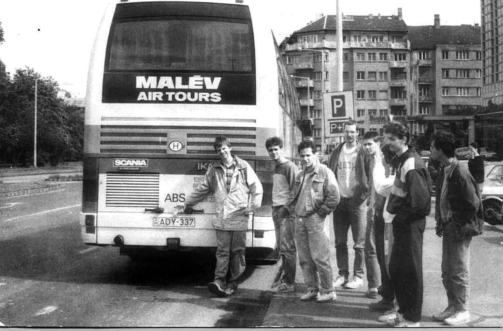

+++
title = 'Hát kérem, ez is Ady…'
type = 'articles'
date = 2022-09-10
kicker = 'KU(L)TÚRA'
author = 'Pulai András'
description = ''
image = 'cover.jpg'
weight = 120
+++

{.align-left}

Közepesen meglepő tény, de nem lettem egy igazán versolvasó ember. Ugyanakkor pozitív irányba változott a viszonyom több verssel kapcsolatban is. A gyerekeknek néha meg kell tanulni egy-egy memoritert. Amikor gyakorlásként felmondták, és én meghallgattam – mondom, nem lettem igazán versolvasó ember –, akkor jöttem rá arra, hogy ezeket a verseket tiniként mennyire nem éltem meg.

Az egyik memoriter Ady _Párisban járt az Ősz_ című verse volt. Történt, hogy fontos söröznivalóm akadt a városban egy késő tavaszi napon. Ilyenkor arra kell figyeljek, hogy a Nyugatiból 23:52-kor induló S70-es személyt még elérjem. Amikor leszállok a vonatról, még egy jó tizenöt perces séta vár rám hazáig a teljesen kihalt Pálya utcán. Ezen az estén azt sikerült átérezni, hogy mennyire tök jó itt lenni és élvezni az életet annak ellenére, hogy valószínűleg már a B oldal pörög.

Gimnazistaként érted, hogy miről szól az a vers. De most konkrétan megéltem azokat a pillanatokat és érzéseket, amiket ezek a versek írnak le nagyon jól. Hát kérem, ez történt meg velem az elmúlt pár évben, és nagyon érdekes felfedezés volt.
