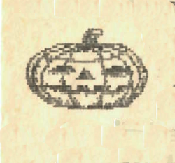
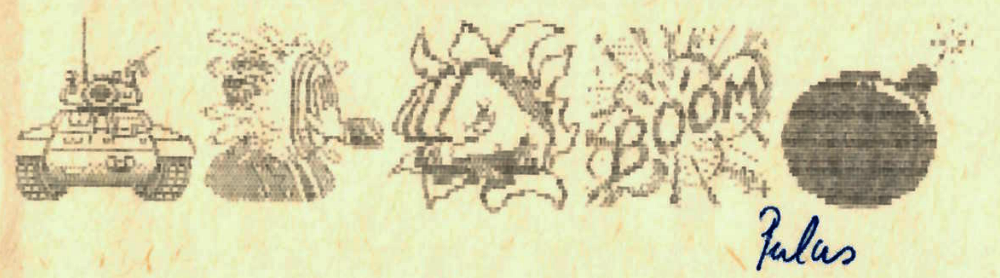

+++
title = '_Eszperantiában jártunk_'
type = 'articles'
date = 1990-09-03
author = 'Pulus'
description = ''
weight = 20
+++

{.align-left}



Köszöntöm kedves olvasóimat akik kitüntetnek avval, hogy elolvassák első cikkemet a Pimpa és Tudomány hasábjain. Cikkem nem titkolt célja az „Esperanto“ népszerűsítése ami valójában (tök) fölösleges hiszen sokunk sokkal szívesebben tanulja ezt a nyelvet mint a szláv nyelvek valamelyikét.

E röpke prológus után végre belevághatok a dolgok közepébe. Eszperantia Pécs city-től É-ra 14-kmre helyezkedik el Abaligeten. Sok itt az Eszperantus, kevés a néger és nincsenek arabok. Voltak itt dajcsok (deutsch) ,törökök , belgák , csehek stb. Ennek jelentősége azonban eltörpül itt megszerzett tudásom mellett. Sok magyarnak hitt szó jelentését akkor és ott értettem meg igazán. Például : laca, kati , doni (dani ), peti.
Eme szavakat érdemesnek tartom arra, hogy jelentésüket röviden ismertessem. Kezdjük a kati című szóval. Az Esperanto -i végződés azt mutatja, hogy valamilyen igével van dolgunk. Esperantoul kato=macska így a kati szó jelentése kb.: macskáni. Peti kb annyit tesz : kérni , doni annyit tesz adni.( Néha látni ilyenkor Dani feje fölött a glóriát is !).
Szándékosan hagytam utoljára a laca szót , ezt a szót sokunk eddig így ismerte Laca(alias P.L.) Laca Esperantoul annyit tesz fáradt. A szónak ismert még laco változata ez fáradtságot jelent. Ha becézni szeretnénk azt mondjuk laciga (g=k) így a szó azt jelenti FÁRASZTÓ. Aki szeretve tisztelt és nagyra becsült főfőszerkesztőnk nevére hasonló szójátékokat tud kitalálni, megfejtését az Esperanto baráti kör bármely tagja előtt leadhatja **(DE LEGFŐBBKÉPPEN E CIKK SZINTÉN NAGYRABECSÜLT SZERZŐJÉNEK. - A SZERK. MEGJ.)**. A legjobbakat P.L. valószínűleg díjazni fogja !!!!

**/ ESETLEGES FOLTOKÉRT ILL. 8. NAPON BELÜL ÉS TÚL GYÓGYULÓ SÉRÜLÉSEKÉRT FELELŐSSÉGET NEM VÁLLALOK !!! PULUS /**





Az itt szereplő írás csupán az írói fantázia műve. Szereplőinek élő személyekkel való minden nemű hasonlatossága pusztán a véletlen műve.

« Szerk. »


