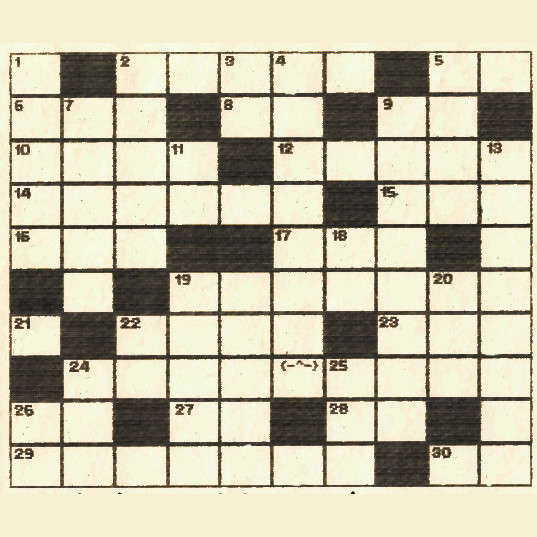

+++
title = 'Keresztrejtvény'
type = 'articles'
date = 1990-09-03
author = 'SZ.T.'
description = ''
weight = 40
+++



Megfejtésként a kitöltött rejtvényt kell bemutatni SZ.T.-nek. Az erkölcsi tanulság a függőleges 4. sorban rejtőzik.

**MEGHATÁROZÁSOK:**

**VÍZSZINTES:** 2. fiú is, lány is van ilyen nevű 5. cézium 6. japán mükorcsolyázónő 8. a csodák csodája 9. angol létige egyik alakja 10. becézett angol kir. légierő 12. gusztustalan vízi élőlények 14. névtelen 15. almatermeléséről híres szovjet város 16. Vágó András foltartója angolul 17. én eszek, te eszel, ő ... 19. virrasztásáról híres sziciliai tájképfestő 21. rendkívül fontos betű 22. LIFF 23. quatromanuális földmunkagép 26. mutató névmás 27. téli sportokra használt mértékegységrendszer 28. régi csodálkozás 29. szükséges, Vágó Andrásnál 30. majdnem AT

**FÜGGŐLEGES:** 1. növény is állat is ember is van ilyen 2. jobb adni mint kapni 3. Lamartine is fürdött benne 4. ez a megfejtés 5. szíjon is és hajón is van 7. matekos ritkán tesz ilyet 9. Katanics S. eposzi jelzője 11. -ba -be -ban -ben 13. tasocedeb fordítva 18. szilícium 19. tréfás helyesírású szó 20. olasz, svéd, spanyol autójel 21. u.a. mint a vízsz. 21. 22. gyakran hűtik 24. Magyarországot rágja 25. játékadapter 26. matematikatanárunk

( Ékezet sehol sem számít! )



