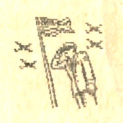

+++
title = 'Szaddám Husszein támogatja a Paralelepipedon Rt.-t ?!?'
type = 'articles'
date = 1990-09-03
author = '< P. L. >'
description = ''
weight = 30
+++

{.align-left}



A HVG augusztus 18-i számában arról is olvashattunk, hogy "néhány órával azután, hogy az amerikai tömegkommunikációs eszközök bejelentették a Kuvait elleni iraki támadást, a New York-i értéktőzsdén esni kezdett a Walt Disney cég részvényeinek árfolyama." Hogy miért ? Nos, az értékpapír-kereskedők hamar rájöttek, hogy az iraki támadás hatására emelkedni fognak az olajárak. Ha az olajárak emelkednek, akkor a benzin is drágább lesz és kevesebben fogják felkeresni a Disney-parkokat, emiatt csökken a Disney-cég nyeresége. Ezek után már minket is érdekelni kezdett, hogy lehet-e valamilyen kapcsolat Szaddám Husszein iraki diktátor és a Paralelepipedon Rt. között. Mi is abból indultunk ki, hogy az olajárak növekedni fognak, és így a benzinárak is. Az emberek emiatt keveset utaznak, autójukat csak akkor használják ha feltétlenül szükséges. De, ha keveset utaznak lényegesen több lesz a szabadidejük. Sajnos a Magyar Televízió ritkán kápráztatja el érdekes műsorokkal a nézőközönséget. Maradt tehát az újságolvasás. De milyen újságot érdemes olvasni? Természetesen olyat, ami érdekes, szórakoztató, sok hasznos információt tartalmaz, színvonalas, .... Azt hiszem nem kell hosszan bizonygatnom, hogy ez mind elmondható a P&T.-ről. Sőt! A P&T-ből még azt is megtudhatják, hogy mikor érdemes kockázatos üzleti vállalkozásokba bocsátkozni, hiszen tudjuk, hogy a kenyai horoszkóp az esetek 93,643254178 %-ában jól működik.

Az előbbiekből kitűnik, hogy a P&T olvasóinak száma emelkedni fog, ez pedig nagyobb nyereséget biztosít a Paralelepipedon Rt.-nek.

Így végső soron Szaddám Husszein valóban támogatta a Paralelepipedon Rt.-t amikor bevonult Kuvaitba, ám nem igaz az imperialista híresztelés, hogy Szaddám Husszein meg a Pimpa és Tudomány....



